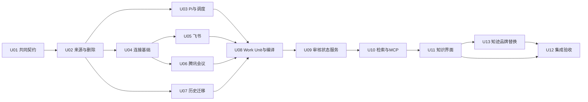

# 知迹 · Local Brain 首版实施计划

> 已按用户明确范围生成。首版为飞书、腾讯会议只读接入，所有接入操作放主侧栏「连接」；WPS 与国内 Runtime 后置。本轮跳过规划前采样、PoC、OAuth 和模型联调，不运行产品验证、不启动编码。原评审被本次范围与阶段决定取代，历史缺口由实现节点处理。

## 1. 目标与交付范围

交付“办公/采集证据 → Work Unit → SOP / DecisionRule / ExceptionPlaybook → 自审发布 → 中文本地检索与带引用问答 → 反馈修订/删除”闭环。沿用指定 Pi 的 `shawnhub-copy / deepseek-v4-flash-0731`、不设费用/每日调用硬上限、历史保全/新增优先/显式7天回填、约5分钟集中审核。（2026-09-08 变更：模型绑定改为复用「模型与密钥」选中预设、支持手动切换 Runtime，不设费用/每日调用硬上限维持不变。）

连接范围为飞书消息与文档、腾讯会议已有权限的转写和纪要。默认手动导入，自动同步显式启用；不扩展全账号历史、办公写操作、WPS、向量、外部记忆或新Runtime。平台原件留在平台，导入副本与派生知识的本地生命周期由Screenpipe管理。资料可访问不能证明用户处理过它。

中文产品品牌为“知迹”，定位“本地优先的个人工作知识库”，介绍“把工作经历，沉淀为自己的知识。”。U13负责全部前端产品品牌展示替换，前端技术字符串与上游署名按PRD R11保留；本轮不修改产品源码。

「连接」复用现有主页面section及 `components/settings/connections-section.tsx`；不另建办公中心。页面覆盖依赖/授权、账号和能力、资源范围、同步/取消/重试、断开与本地资料清理。知识审核与Ask保持其各自入口。

## 2. 源码影响与当前基线

CodeGraph提示连接源码索引已漂移，已直接读取当前文件核对：连接是主侧栏独立section；分类、卡片、刷新事件可复用；Engine存在通用代理，ConnectionManager存在无SecretStore时文件回退。新连接复用展示和生命周期，不开放通用代理，不复用凭据明文回退。现有远程文件SyncScheduler不负责办公内容任务。

本仓库含其他任务的大量未提交前端改动；HEAD不能代表完整规划输入。以下为规划时关键源码SHA-256，开工只读核对实际版本，发现漂移先重定位并更新受影响契约，不重跑已取消的规划前PoC，也不覆盖他人改动。新增路径是计划落点，尚未创建产品文件。

| 文件 | SHA-256 |
|---|---|
| `apps/screenpipe-app-tauri/app/(main)/home/page.tsx` | `6aec5a1d80cccd6bb07d4b4e40badff0538f62aab28ee07761a7daec58ee0953` |
| `apps/screenpipe-app-tauri/components/settings/connections-section.tsx` | `7093c726c1bba67a5aedb0a452f25f6a15e9834f87618d9310bf64a222104670` |
| `apps/screenpipe-app-tauri/lib/constants/connections.ts` | `8742639536a2fa77852e52bb208770bf86831b9b83c8ff79d1bddb1857870671` |
| `crates/screenpipe-connect/src/connections/mod.rs` | `373f8b3a8d3c9bbff3f047fb9685e3a5ae7049947826627e31c11e8e8db8c97d` |
| `crates/screenpipe-engine/src/connections_api.rs` | `418fcb352a38c34c399ec5d44140b388ce3f32d1fab4d5b594b9bb7d42985945` |
| `crates/screenpipe-db/src/db/mod.rs` | `59ddc6fce34511960a4a7e9521f35efb1aa3e2c209a333983f01d8f0734ebfe7` |
| `apps/screenpipe-app-tauri/src-tauri/src/pi.rs` | `c9da57945c02e6e8bdc70cfcb192e68bc3ac26b55f0afc6871c115946e6dd188` |
| `apps/screenpipe-app-tauri/src-tauri/src/activity_history.rs` | `4841215ce5a589c04b59c4a881eea326f601f37d62532280355d598f3ca13758` |
| `apps/screenpipe-app-tauri/src-tauri/src/main.rs` | `842c61480c1702f1b5e65a47f210b1498ab1f111d678c60a4ced462ac8a901cc` |
| `packages/screenpipe-mcp/package.json` | `925dae8783692d15e4112e912df8f31cbf4598f1e9777a6d13738defcc522318` |

直接影响：DB来源/任务/删除表，Engine BrainService与连接路由，两个官方CLI适配，Tauri执行/生命周期，连接卡片及知识/Ask界面，MCP工具。间接影响：旧search/memories、retention、history迁移、凭据边界、生成绑定与缓存。只读内容接入不修改采集/编码热路径。品牌任务另覆盖app/components/lib/public的展示文案、字标及相关UI测试预期，不改原生身份或数据协议。

## 3. 任务与依赖

| ID | 实施单元 | 依赖 | 主要风险 |
|---|---|---|---|
| U01 | 共同契约与接口边界 | 无 | 共享契约漂移 |
| U02 | 来源、数据库与删除基础 | U01 | 删除复活/写锁 |
| U03 | 严格 Pi 执行与持久调度 | U02 | 指定模型/取消清理 |
| U04 | 连接公共执行器与页面骨架 | U02 | 凭据/越权/状态混淆 |
| U05 | 飞书消息与文档纵向接入 | U04 | 权限/分页/文档格式 |
| U06 | 腾讯会议转写与纪要纵向接入 | U04 | 云转写可用性/时间回链 |
| U07 | 历史保全迁移与启用/回填 | U02 | 历史丢失/加密降级 |
| U08 | Work Unit 与三类知识编译 | U03, U05, U06, U07 | 无据推断/错误归组 |
| U09 | 知识版本、自审与反馈服务 | U08 | 版本竞态/错误发布 |
| U10 | 中文 FTS、普通问答与 MCP | U09 | 中文漏召回/旧版泄漏 |
| U11 | 知识审核、Ask 引用与运行状态界面 | U10 | 入口分散/状态不可恢复 |
| U13 | 知迹品牌统一与前端替换 | U11 | 品牌遗漏/误改技术标识/与汉化冲突 |
| U12 | 集成、生命周期与真实使用验收 | U11, U13 | 真实质量/性能/审核负担 |



按依赖计算的最长链为 `U01 → U02 → U04 → U05/U06 → U08 → U09 → U10 → U11 → U13 → U12`；未估工期，不将节点数当作工时。实际默认串行执行 `U01…U11 → U13 → U12`（保留原节点编号）；U03、U04–U06放在知识闭环之前，尽早在实现中处理模型、账号和CLI差异。没有独立预研/验证任务挡在U01之前。

## 4. 公共执行契约

下列字段由每个节点继承，节点自己的字段覆盖公共字段；不省略交接身份。`source_plan_sha256`在完整计划写定后计算，只放下游Task Pack，不把自身hash写入本文件。`task_id`和`source_task_pack_sha256`目前为null，因为本轮未开Build；不得伪造。`source_hash`采用frontmatter中source_artifacts的UTF-8规范JSON（键排序、紧凑分隔、不转义中文）的SHA-256。

```yaml
node_defaults:
  plan_id: plan-personal-brain-local-first
  source_plan_sha256: resolved_from_complete_plan_at_handoff
  base_commit: a255ffdf2d7a36c12a5a471eb4abe556ba14be03
  task_id: null
  source_task_pack_sha256: null
  source_artifacts: inherit_frontmatter_source_artifacts
  source_hash: 9d3716360d2024672c19f3fe4d210876004cf84d2bac5172e87407e497c3a1ed
  actor: local_lead
  parallel_mode: serial_same_worktree
  forbidden_writes:
    - 所有不在当前节点write_ownership内的文件及其他任务的既有改动
    - .git/**、凭据正文、用户全局CLI认证文件、真实办公资料
    - 原始采集/编码热路径、云账号恢复、WPS/国内Runtime实现
    - latest.json、beta/latest.json、企业发布指针、发布标签及远程推送
  evidence_required:
    - 节点ID、实际git_head、基线与完成时来源/计划hash
    - 精确changed_files和实际命令、退出码、通过/失败/未执行原因
    - 脱敏断言与截图/人工验收结论；不得保存token或真实正文到git
    - 拟存.agent或任务运行目录下的node-evidence/<unit-id>.json，由Task Pack确定实际路径
```

每节点能力中的本机授权/桌面动作由主执行者处理；普通单元可在后续明确授权委派时拆分。本轮不创建子任务、不并发写。所有路径按仓库根解析；模型输出不能新增允许路径。

迁移/schema、连接与Brain路由、生成绑定、主导航、依赖清单/锁文件均为串行单写入资源。新增依赖确有必要时由U01契约变更记录，更新计划路径与hash后单写入，不在任意节点顺手改锁文件。

## 5. 节点执行契约

所有验证说明均是实施时要执行的检查，本轮没有运行。每节点完成产品实现后在该节点验证，不将未知项伪装成已验证前提。

### U01 · 共同契约与接口边界

```yaml
inherits: node_defaults
plan_unit_id: U01
depends_on: []
acceptance_ids:
- AC-R1-02
- AC-R3-01
- AC-R5-03
- AC-R6-02
- AC-R9-02
- AC-R9-04
write_ownership:
- crates/screenpipe-db/src/db/brain/types.rs
- crates/screenpipe-engine/src/brain/types.rs
- crates/screenpipe-connect/src/office/types.rs
- apps/screenpipe-app-tauri/lib/brain/types.ts
- apps/screenpipe-app-tauri/lib/connections/office-types.ts
- docs/trd/personal-brain-local-first.md
- crates/screenpipe-db/src/db/mod.rs
- crates/screenpipe-engine/src/lib.rs
- crates/screenpipe-engine/src/brain/mod.rs
- crates/screenpipe-connect/src/lib.rs
- crates/screenpipe-connect/src/office/mod.rs
mutex:
- brain-contracts
- office-contracts
- module-registration
required_skills:
- codebase-analysis
- write-trd
required_capabilities:
- Rust/TS契约
- 仓库读写
parallel_mode: serial_shared_writer
```

1. 固定SourceRef/对象身份、连接/范围revision、任务/错误与删除cause；导入资料与实际活动分开。
2. 确定REST/MCP字段、请求大小、账号命名空间、只读命令动作和接口版本；共享类型只有本节点负责初始定稿。
3. 按当前源码布置最小模块声明；拟新增路径若需移动，同步计划和TRD再交接，不创建空壳通用框架。

验证检查点：序列化往返与非法状态/范围样例；旧API无新增必填字段；声明支持和可见范围有明确字段。

交接信号：契约、字段归属与失败码确定，下游不自行改接口；新增文件路径在Task Pack固化。

### U02 · 来源、数据库与删除基础

```yaml
inherits: node_defaults
plan_unit_id: U02
depends_on:
- U01
acceptance_ids:
- AC-R1-02
- AC-R1-03
- AC-R3-02
- AC-R6-01
- AC-R6-02
- AC-R6-03
write_ownership:
- crates/screenpipe-db/src/db/brain/
- crates/screenpipe-db/src/db/mod.rs
- crates/screenpipe-db/src/db/activity_ledger.rs
- crates/screenpipe-db/src/db/memories.rs
- crates/screenpipe-db/src/migrations/*brain*.sql
- crates/screenpipe-engine/src/brain/sources.rs
- crates/screenpipe-engine/src/brain/deletion.rs
- crates/screenpipe-engine/src/retention.rs
- crates/screenpipe-engine/src/routes/memories.rs
- crates/screenpipe-core/src/memories/external_sync.rs
- crates/screenpipe-engine/src/brain/mod.rs
mutex:
- sqlite-schema
- db-writer
- brain-contracts
- module-registration
required_skills:
- codebase-analysis
required_capabilities:
- Rust/SQLx
- 事务与恢复
parallel_mode: serial_shared_writer
```

1. 按TRD建source/revision/dependency/job/office状态等同库表和唯一约束，所有写入经过DatabaseManager。
2. 建立持久删除journal、读/提交屏障、无正文抑制、批清理与retention文本/媒体区分。
3. 接入采集/memory删除和范围删除；为办公对象及后续派生层提供强制登记依赖的存储方法。

验证检查点：临时DB覆盖主键复用、并发删除/提交、恢复重放、retention豁免；cargo test -p screenpipe-db --lib，相关Engine删除测试。

交接信号：任何新持久正文都可追溯并删除，失败清理可恢复；禁止下游绕过此存储接口。

### U03 · 严格 Pi 执行与持久调度

```yaml
inherits: node_defaults
plan_unit_id: U03
depends_on:
- U02
acceptance_ids:
- AC-R8-01
- AC-R8-02
- AC-R6-04
- AC-EVAL-06
write_ownership:
- crates/screenpipe-engine/src/brain/worker.rs
- crates/screenpipe-engine/src/brain/executor.rs
- apps/screenpipe-app-tauri/src-tauri/src/brain_runtime.rs
- apps/screenpipe-app-tauri/src-tauri/src/pi.rs
- apps/screenpipe-app-tauri/src-tauri/src/main.rs
- apps/screenpipe-app-tauri/src-tauri/src/specta_bindings.rs
- apps/screenpipe-app-tauri/lib/utils/tauri.ts
- crates/screenpipe-engine/src/brain/mod.rs
mutex:
- desktop-lifecycle
- pi-executor
- generated-bindings
- module-registration
required_skills:
- codebase-analysis
- screenpipe-tauri
required_capabilities:
- Rust异步/进程
- Keychain
- 本机原生测试
parallel_mode: serial_shared_writer
```

1. 绑定指定Preset/provider/model与Keychain引用，禁止静默回落模型、任意resolver和工具/扩展加载。
2. 实现租约/优先级、10秒排队/60秒answer总时限、后台有界步骤、最多3次模型调用及null每日预算。
3. 接入Tauri启动/退出、取消/kill/reap、临时目录与受管会话清理；先实现再在本节点验证旧DR-TRD-002，不另开规划前spike。

验证检查点：Mock executor故障注入；bun run test:tauri 的绑定/取消/目录用例；实际选定模型调用纳入节点验收，凭据不进日志。

交接信号：应用内指定模型能受限执行，退出/删除/取消不会提交旧结果；原生证据与mock结果分开。

### U04 · 连接公共执行器与页面骨架

```yaml
inherits: node_defaults
plan_unit_id: U04
depends_on:
- U02
acceptance_ids:
- AC-R9-02
- AC-R9-04
- AC-R6-04
write_ownership:
- crates/screenpipe-connect/src/office/
- crates/screenpipe-connect/src/lib.rs
- crates/screenpipe-engine/src/brain/office.rs
- crates/screenpipe-engine/src/connections_api.rs
- apps/screenpipe-app-tauri/src-tauri/src/office_runtime.rs
- apps/screenpipe-app-tauri/src-tauri/src/main.rs
- apps/screenpipe-app-tauri/components/settings/connections-section.tsx
- apps/screenpipe-app-tauri/components/settings/office-connection-card.tsx
- apps/screenpipe-app-tauri/lib/connections/office.ts
- apps/screenpipe-app-tauri/lib/constants/connections.ts
- apps/screenpipe-app-tauri/lib/connections-events.ts
- crates/screenpipe-engine/src/brain/mod.rs
mutex:
- office-contracts
- desktop-lifecycle
- connections-router
- connections-ui
- module-registration
required_skills:
- codebase-analysis
- screenpipe-tauri
required_capabilities:
- Rust子进程
- Keychain/OAuth
- React中文状态
parallel_mode: serial_shared_writer
```

1. 实现固定官方CLI版本的发现/受管安装、仅用户发起授权、白名单argv与取消，复用已有全局CLI但不升级/注销它；每次读取核对实际账号，外部切号即暂停。
2. 实现/office专用认证路由、独立运行/授权/同步状态与范围revision；拒绝通用任意API代理及明文凭据回退。
3. 在现有连接列表注册两张卡片及状态/范围公共面板；先交付真实不可用/未连接状态与fake-CLI集成路径，不显示虚假已连接。
4. 导入job/cursor共用数据库屏障；默认手动、自动15分钟且需显式启用，权限范围与AI历史回填独立。

验证检查点：fake CLI验证argv注入、输出/超时上限、取消和凭据不泄漏；连接路由与旧连接回归；browser-mock检查空/失败/授权/partial状态。

交接信号：两款工具可复用同一受限执行/状态骨架，供应商适配无需改通用代理；页面刷新与后台生命周期一致。

### U05 · 飞书消息与文档纵向接入

```yaml
inherits: node_defaults
plan_unit_id: U05
depends_on:
- U04
acceptance_ids:
- AC-R9-01
- AC-R9-02
- AC-R9-04
- AC-R6-01
write_ownership:
- crates/screenpipe-connect/src/office/feishu.rs
- crates/screenpipe-connect/tests/fixtures/office/feishu/
- apps/screenpipe-app-tauri/components/settings/feishu-connection-panel.tsx
- apps/screenpipe-app-tauri/components/settings/__tests__/feishu-connection-panel.test.tsx
mutex:
- office-contracts
- connections-ui
required_skills:
- codebase-analysis
required_capabilities:
- 飞书CLI
- 分页/文档格式
- React
parallel_mode: serial_same_worktree
```

1. 适配固定lark-cli版本的文档读取、会话时间过滤、消息搜索/详情，按真实格式解析而不假定Markdown。
2. 通过连接面板补必要授权、选择文档/会话及窗口，展示发送者/时间/链接/完整度；不读取未选范围。
3. 按账号/消息/文档ID幂等入库，分页续传、编辑修订、删除抑制与断开取消贯穿整条路径。

验证检查点：脱敏CLI响应夹具覆盖缺scope、分页重复/失败、消息编辑、文档格式；实施阶段用指定样本验收正文、身份与回链，不能仅依据auth状态。

交接信号：飞书消息与文档均可从连接页导入本地来源，已导入数和最近成功时间可核对；不支持能力有明确状态。

### U06 · 腾讯会议转写与纪要纵向接入

```yaml
inherits: node_defaults
plan_unit_id: U06
depends_on:
- U04
acceptance_ids:
- AC-R9-01
- AC-R9-02
- AC-R9-04
- AC-R6-01
write_ownership:
- crates/screenpipe-connect/src/office/tencent_meeting.rs
- crates/screenpipe-connect/tests/fixtures/office/tencent-meeting/
- apps/screenpipe-app-tauri/components/settings/tencent-meeting-connection-panel.tsx
- apps/screenpipe-app-tauri/components/settings/__tests__/tencent-meeting-connection-panel.test.tsx
mutex:
- office-contracts
- connections-ui
required_skills:
- codebase-analysis
required_capabilities:
- 腾讯会议CLI
- 转写时序
- React
parallel_mode: serial_same_worktree
```

1. 适配固定tmeet版本，选择明确会议或本人可访问会议的时间窗口；读取已有录制/转写与智能纪要。
2. 分别处理列表与段落游标，保存会议/录制/段落身份和时间；未知说话人为空，AI纪要与原始转写分源。
3. 处理账号不支持、无录制、转写处理中和权限不足；不下载全量录像、不创建/修改会议；依赖和授权都从连接页完成。

验证检查点：脱敏夹具覆盖pid/limit分页、pending、403、重试和重复录制；实施阶段验证一场可访问会议的真实转写与时间回链。

交接信号：可用转写可导入，未就绪/无权限不误报成功；无云转写时保留已有本地音频路径，不伪造内容。

### U07 · 历史保全迁移与启用/回填

```yaml
inherits: node_defaults
plan_unit_id: U07
depends_on:
- U02
acceptance_ids:
- AC-R1-04
- AC-R8-03
- AC-R6-02
write_ownership:
- apps/screenpipe-app-tauri/src-tauri/src/activity_history.rs
- apps/screenpipe-app-tauri/src-tauri/src/brain_migration.rs
- crates/screenpipe-engine/src/brain/migration.rs
- crates/screenpipe-db/src/db/brain/history.rs
- crates/screenpipe-engine/src/brain/mod.rs
mutex:
- history-writer
- db-writer
- module-registration
required_skills:
- codebase-analysis
- screenpipe-tauri
required_capabilities:
- SQLite迁移
- 原生加密/恢复
parallel_mode: serial_shared_writer
```

1. 保全合法entries/coverage，分批幂等导入、校验与原子读切换，任何时刻一个有效writer。
2. 原有加密不降级、Keychain不可用暂停；旧store自身key/受管备份清理不伤用户其他设置。
3. 固定enabled_at、跨界/迟到证据归属与用户显式7天回填；迁移不触发全历史模型重算。

验证检查点：临时快照对比ID/正文摘要/coverage；每个提交/切换点故障恢复、旧备份删除重放、加密key拒绝与恢复。

交接信号：合法历史保全且可恢复；首次启用、办公导入和AI回填三个状态可区分。

### U08 · Work Unit 与三类知识编译

```yaml
inherits: node_defaults
plan_unit_id: U08
depends_on:
- U03
- U05
- U06
- U07
acceptance_ids:
- AC-R1-01
- AC-R1-02
- AC-R1-03
- AC-R2-01
- AC-EVAL-02
write_ownership:
- crates/screenpipe-engine/src/brain/extract.rs
- crates/screenpipe-engine/src/brain/compile.rs
- crates/screenpipe-engine/src/brain/registry/
- crates/screenpipe-engine/src/brain/prompts/
- crates/screenpipe-db/src/db/brain/work_units.rs
- crates/screenpipe-engine/src/brain/mod.rs
- crates/screenpipe-db/src/db/brain/mod.rs
mutex:
- brain-contracts
- knowledge-registry
- module-registration
required_skills:
- codebase-analysis
required_capabilities:
- 证据建模
- 中文prompt/schema
- 持久任务
parallel_mode: serial_same_worktree
```

1. final区间建立稳定输入修订并生成字段级引用的WorkUnit，空结果/未知事实不补造。
2. 只将有明确活动关联的办公资料补入工作轨迹；独立导入资料保留为可检索内容。
3. 三种知识类型采用内部注册表，SOP至少3独立同流程会话，单次规则/异常标适用边界；输入变化可重算。

验证检查点：合成证据覆盖迟到/分拆合并/分类改动、注入文本、伪造引用与空字段；真实编译质量交U12，不用JSON合法率代替事实支持率。

交接信号：合法WorkUnit与有据候选可生成，输入变更/删除使旧任务失效；每层派生正文已登记清理。

### U09 · 知识版本、自审与反馈服务

```yaml
inherits: node_defaults
plan_unit_id: U09
depends_on:
- U08
acceptance_ids:
- AC-R2-02
- AC-R2-03
- AC-R7-01
- AC-R7-02
- AC-R6-01
write_ownership:
- crates/screenpipe-db/src/db/brain/knowledge.rs
- crates/screenpipe-db/src/db/brain/feedback.rs
- crates/screenpipe-engine/src/brain/knowledge.rs
- crates/screenpipe-engine/src/brain/feedback.rs
- crates/screenpipe-engine/src/brain/routes.rs
- crates/screenpipe-engine/src/server.rs
- crates/screenpipe-engine/src/brain/mod.rs
- crates/screenpipe-db/src/db/brain/mod.rs
mutex:
- knowledge-state
- brain-router
- db-writer
- module-registration
required_skills:
- codebase-analysis
required_capabilities:
- 版本状态机
- 事务/CAS
parallel_mode: serial_shared_writer
```

1. 候选编辑/发布/驳回、版本替换、暂停/废止、30天复核与驳回抑制。
2. 来源变化/权限停用/删除传播到知识可用性；发布瞬间重验来源及expected revision。
3. 反馈定位声明/版本，错误先暂停、修订后自审；未知版本进入待处理，删除清除历史/反馈正文。

验证检查点：v1可用/v2待审、原子替换、并发编辑409、到期查询即时暂停、无支持事实拒绝发布和删除竞态。

交接信号：版本状态/可用性分离且服务端强制执行，UI不能直接篡改发布指针。

### U10 · 中文 FTS、普通问答与 MCP

```yaml
inherits: node_defaults
plan_unit_id: U10
depends_on:
- U09
acceptance_ids:
- AC-R3-01
- AC-R3-02
- AC-R3-03
- AC-R4-01
- AC-R5-01
- AC-R5-02
- AC-R5-03
- AC-R6-04
write_ownership:
- crates/screenpipe-db/src/db/brain/search.rs
- crates/screenpipe-db/src/text_normalizer.rs
- crates/screenpipe-engine/src/brain/search.rs
- crates/screenpipe-engine/src/brain/answer.rs
- crates/screenpipe-engine/src/brain/routes.rs
- packages/screenpipe-mcp/src/
- packages/screenpipe-mcp/tests/
- crates/screenpipe-engine/src/brain/mod.rs
- crates/screenpipe-db/src/db/brain/mod.rs
mutex:
- brain-router
- search-contracts
- mcp-contracts
- module-registration
required_skills:
- codebase-analysis
required_capabilities:
- FTS/中文检索
- REST/MCP
- 证据引用
parallel_mode: serial_shared_writer
```

1. 建立可重建中文投影、单来源过滤与连接/来源/发布/删除revision缓存失效；旧/search完全保持默认行为。
2. answer只查本地，使用严格普通completion；声明级引用、未知/冲突/部分失败/不可用明确，返回前再验来源。
3. 新增answer/get_brain_source MCP工具，共用REST错误与有效性，旧memory工具及文件出口兼容；不在Ask隐式同步办公内容。

验证检查点：中英/二字/自然问句、partial/no_hits/unavailable、范围缩小/删除/切版缓存；旧/search回归；MCP bun run test与typecheck。

交接信号：本地已导入资料和可用知识能被引用，REST/MCP一致，未启用连接与问答阶段无办公平台请求。

### U11 · 知识审核、Ask 引用与运行状态界面

```yaml
inherits: node_defaults
plan_unit_id: U11
depends_on:
- U10
acceptance_ids:
- AC-R2-02
- AC-R2-03
- AC-R5-01
- AC-R7-01
- AC-R7-02
- AC-R8-03
- AC-R9-04
- AC-EVAL-05
write_ownership:
- apps/screenpipe-app-tauri/components/brain/
- apps/screenpipe-app-tauri/lib/brain/
- apps/screenpipe-app-tauri/app/(main)/home/page.tsx
- apps/screenpipe-app-tauri/components/settings/office-connection-card.tsx
- apps/screenpipe-app-tauri/components/settings/feishu-connection-panel.tsx
- apps/screenpipe-app-tauri/components/settings/tencent-meeting-connection-panel.tsx
mutex:
- main-navigation
- brain-ui
- connections-ui
required_skills:
- codebase-analysis
required_capabilities:
- React
- 浏览器UI测试
- 无障碍
parallel_mode: serial_same_worktree
```

1. 在现有Brain入口增加知识与集中审核，支持来源对照/编辑/发布/驳回/版本比较/反馈；Ask展示逐项引用。
2. 显示迁移/新增/回填、待审积压、未知/过期/媒体已清理/删除重试状态；操作结果以服务为准。
3. 连接操作始终留在主侧栏连接；完善两张卡片范围/状态与断开清理，键盘/焦点/中文文案遵守现有设计。

验证检查点：browser-mock覆盖核心状态与完整操作；来源详情/反馈/v2发布、连接离页返回/重启状态；相关前端测试与typecheck。

交接信号：用户能完成连接与知识闭环，依赖诊断折叠、无CLI命令/秘密输入流；约5分钟审核目标留待真实观察。

### U13 · 知迹品牌统一与前端替换

```yaml
inherits: node_defaults
plan_unit_id: U13
depends_on:
- U11
acceptance_ids:
- AC-R11-01
- AC-R11-02
- AC-R11-03
write_ownership:
- apps/screenpipe-app-tauri/lib/brand.ts
- apps/screenpipe-app-tauri/app/**/*.tsx
- apps/screenpipe-app-tauri/components/**/*.tsx
- apps/screenpipe-app-tauri/lib/**/*.ts
- apps/screenpipe-app-tauri/lib/**/*.tsx
- apps/screenpipe-app-tauri/public/
- apps/screenpipe-app-tauri/e2e/specs/
- docs/reviews/personal-brain-brand-retained-identifiers.md
forbidden_writes:
- 继承node_defaults.forbidden_writes；上述目录只允许品牌展示、必要常量引用和直接相关测试预期/字标改动
- 仓库/包/crate/API/MCP/URL/scheme/事件/配置/storage key/路径及生成的lib/utils/tauri.ts
- src-tauri原生实现/配置、应用包/进程/签名/权限身份、许可证/上游署名/代码头
- 用户历史内容、无关汉化与业务逻辑、依赖清单和锁文件
mutex:
- frontend-brand
- main-navigation
- brain-ui
- connections-ui
- frontend-localization
required_skills:
- codebase-analysis
required_capabilities:
- React/TypeScript
- 前端画面与无障碍检查
- 品牌文字与技术标识区分
parallel_mode: serial_same_worktree
```

1. 扫描app/components/lib/public中的产品品牌、字标、标题、通知、alt/aria-label与tooltip，以及直接依赖这些展示的现有e2e用例；先输出精确修改文件清单和具名保留项，Task Pack只纳入该清单。广目录只用于限定扫描落点，不授权改动其他逻辑。
2. 建立lib/brand.ts展示常量，将默认产品名统一为“知迹”，定位与介绍按PRD；关于/帮助可显示“知迹 · Screenpipe”。覆盖已有页面及U04–U11新增页面。
3. 处理内嵌英文产品字标、空/错误态、权限引导和通知；系统实际名称、技术标识、外部产品/上游署名、用户历史内容保留，必要时加中文说明。
4. 更新直接受品牌文案影响的现有UI测试预期；保持其他汉化修改，禁止全仓机械替换、批量改快照掩盖不一致或修改生成绑定。残留清单及画面证据进入本节点交接。

验证检查点：前端品牌残留扫描加具名例外；启动/引导、首页、知识/Ask、设置/连接、错误/空态和通知的画面/无障碍检查；相关前端检查与typecheck；对比命令/链接/scheme/配置键及系统权限提示未误改。不为单个常量增加镜像测试，不要求原生更名构建。

交接信号：AC-R11-01..03有证据，所有当前产品品牌展示为知迹，英文残留均有明确保留理由；U12可开始最终验收。当前节点未执行，不表示前端已完成替换。

### U12 · 集成、生命周期与真实使用验收

```yaml
inherits: node_defaults
plan_unit_id: U12
depends_on:
- U11
- U13
acceptance_ids:
- AC-R1-01
- AC-R1-02
- AC-R1-03
- AC-R1-04
- AC-R2-01
- AC-R2-02
- AC-R2-03
- AC-R3-01
- AC-R3-02
- AC-R3-03
- AC-R4-01
- AC-R5-01
- AC-R5-02
- AC-R5-03
- AC-R6-01
- AC-R6-02
- AC-R6-03
- AC-R6-04
- AC-R7-01
- AC-R7-02
- AC-R8-01
- AC-R8-02
- AC-R8-03
- AC-R9-01
- AC-R9-02
- AC-R9-03
- AC-R9-04
- AC-EVAL-01
- AC-EVAL-02
- AC-EVAL-03
- AC-EVAL-04
- AC-EVAL-05
- AC-EVAL-06
- AC-EVAL-07
- AC-R11-01
- AC-R11-02
- AC-R11-03
write_ownership:
- docs/reviews/personal-brain-local-first-acceptance.md
- docs/roadmap.md
- docs/plans/personal-brain-local-first-execution-plan.md
- apps/screenpipe-app-tauri/e2e/specs/local-brain*.spec.ts
- crates/screenpipe-engine/tests/brain/
- crates/screenpipe-db/tests/brain/
- packages/screenpipe-mcp/tests/
mutex:
- acceptance-snapshot
- release-measurement
required_skills:
- screenpipe-api
- screenpipe-cli
required_capabilities:
- 本机桌面/浏览器
- 真实授权样本
- 指标评测
parallel_mode: serial_same_worktree
```

1. 冻结两款工具/CLI/模型/机器与≥10真实会话、≥3同流程、30–50保留查询；真实材料存本地受控目录，不进git。
2. 覆盖跨工具导入→活动关联→SOP v1→反馈→v2→来源删除，以及重连/范围缩小/编辑/分页/退出/恢复。
3. 测中文内容指标、事实支持/引用/可回答率、resource/SLA和5工作日集中审核；失败和不可测项如实保留，不调整分母。
4. 完成节点证据汇总后再更新完成状态；阻塞修复回到对应节点，不用验收节点随意修改全部代码。不发布、不推送。

验证检查点：执行TRD V1–V13与本计划37项映射，按改动范围运行仓库测试；真实与mock证据区分，输出结果/失败/未测/限制。

交接信号：37项首版有实际通过证据或用户明确接受的具名残余风险；未测绝不自动计通过，品牌遗漏也不能记为完成，未完成不更新completed。

## 6. 并行与写入归属

本次选择单一主执行者、同工作区串行。U13位于U11之后、U12之前，与全部前端UI及汉化任务共享文件，禁止并发写；其广目录范围在Build前按实际品牌匹配收窄为精确文件清单。U03/U04共享Tauri入口，U04/U05/U06/U11共享连接界面边界，U01/U02/U09/U10共享类型/schema/路由，不能同时写。U05与U06的供应商文件可在未来使用独立worktree并行，但公共契约先冻结、最终集成仍由一个writer执行；本计划当前不授权并行派发。

路径归属已按仓库相对路径归一化；发现的重叠是上述明确串行资源，不存在获准并发写的重叠节点。任何新增注册/生成文件属于共享变更，先回共同契约节点修改所有权，不能以适配器任务名扩大写范围。

## 7. 实施验收与证据

| 检查入口 | 使用时机与范围 |
|---|---|
| 根目录 `cargo test -p screenpipe-db --lib` | 来源/修订、事务、迁移、删除与FTS；临时库，不读用户live DB |
| 根目录 `cargo test -p screenpipe-connect --lib` | 官方CLI适配、固定argv、范围/分页/错误与身份；fake CLI和脱敏响应 |
| 根目录 `cargo test -p screenpipe-engine --lib` | Worker、REST、引用、取消、连接停用和恢复；按实际新增测试缩小过滤范围 |
| 桌面目录 `bun run test:tauri` | Pi/Keychain、进程、应用生命周期与迁移；由native build queue/cache执行，禁止raw cargo/tauri |
| 桌面目录 `bun run test`、`bun run typecheck` | 连接/知识UI的相关前端测试；局部改动优先实际对应测试名 |
| MCP目录 `bun run test`、`bun run typecheck` | answer/source工具与旧memory契约一致性 |
| browser-mock / 实际开发版 | 普通UI用mock；授权回调、退出恢复等native边界再用开发版，非每节点重复native构建 |
| U12真实质量与性能 | ≥10会话、30–50保留查询、两款工具≥90%内容正确导入且中文可检索、至少1可用SOP、v1→v2→删除、固定模型与资源/SLA、5工作日审核观察 |

具体新增测试名随节点实现落定，命令不得以“零测试被选中”当通过；没有新改动或失败不重复扩大测试。API使用运行实例的认证LocalApiContext，不写死3030。测试与真实样本的授权在实际执行时处理，本轮不启动授权。

37项首版验收按PRD定义，AC-R4-02与R10后置，R11品牌在首版。主要责任节点如下（U12汇总最终质量，不代替各节点边界测试）：

| 验收ID | 实现/验证节点 |
|---|---|
| AC-R1-01 | U08, U12 |
| AC-R1-02 | U01, U02, U08, U12 |
| AC-R1-03 | U02, U08, U12 |
| AC-R1-04 | U07, U12 |
| AC-R2-01 | U08, U12 |
| AC-R2-02 | U09, U11, U12 |
| AC-R2-03 | U09, U11, U12 |
| AC-R3-01 | U01, U10, U12 |
| AC-R3-02 | U02, U10, U12 |
| AC-R3-03 | U10, U12 |
| AC-R4-01 | U10, U12 |
| AC-R5-01 | U10, U11, U12 |
| AC-R5-02 | U10, U12 |
| AC-R5-03 | U01, U10, U12 |
| AC-R6-01 | U02, U05, U06, U09, U12 |
| AC-R6-02 | U01, U02, U07, U12 |
| AC-R6-03 | U02, U12 |
| AC-R6-04 | U03, U04, U10, U12 |
| AC-R7-01 | U09, U11, U12 |
| AC-R7-02 | U09, U11, U12 |
| AC-R8-01 | U03, U12 |
| AC-R8-02 | U03, U12 |
| AC-R8-03 | U07, U11, U12 |
| AC-R9-01 | U05, U06, U12 |
| AC-R9-02 | U01, U04, U05, U06, U12 |
| AC-R9-03 | U12 |
| AC-R9-04 | U01, U04, U05, U06, U11, U12 |
| AC-R11-01 | U13, U12 |
| AC-R11-02 | U13, U12 |
| AC-R11-03 | U13, U12 |
| AC-EVAL-01 | U12 |
| AC-EVAL-02 | U08, U12 |
| AC-EVAL-03 | U12 |
| AC-EVAL-04 | U12 |
| AC-EVAL-05 | U11, U12 |
| AC-EVAL-06 | U03, U12 |
| AC-EVAL-07 | U12 |

## 8. 取消预验证后的风险处理

| 未验证事项 | 已定处理方式 | 责任节点 |
|---|---|---|
| 飞书消息权限/CLI输出与账号身份 | 按官方CLI契约实现；缺scope在连接中提示补授权，禁止扩大读取 | U04/U05 |
| 腾讯会议账号资格/云转写可用性 | 按能力显示，不支持或无转写时保留明确状态；不偷偷改回屏幕截图冒充成功 | U04/U06 |
| 应用内Pi模型/Keychain/取消清理 | 按TRD严格profile实现并在节点内验证，失败不换模型 | U03 |
| CLI认证和固定版本安装细节 | 复用厂商正式方式与已有安装机制；新增凭据只存Keychain，不支持时配置失败，记录具体限制 | U04 |
| 前端品牌遗漏或误改技术字符串 | 知迹展示常量、具名残留/保留清单及画面核对；不改原生身份或用户历史 | U13/U12 |
| 真实流程、检索质量与使用负担 | 开发用脱敏/合成夹具，保留集在U12前冻结；未测项明确列出 | U08/U10/U12 |

供应商细节变化属于节点实现中的兼容处理，不能静默增加WPS、写操作、新Runtime或绕过来源/凭据限制。若实际无法支持目标能力，记录事实和影响并带着可审阅改动反馈，不回写“通过”。

## 9. 后续交接与远端输入

本轮停止在计划生成。下一轮收到实施指令后，由agent-brain建立外层Task Pack，再交给implement-plan逐节点执行；传递本计划完整hash、实际base_commit、source_artifacts/source_hash、plan_unit_id、allowed_paths和acceptance_ids。当前没有Task Pack，也没有新plan_to_build评审；用户跳过的是本轮规划前验证，不伪造ready。后续若需要形式化Build交接，按届时明确指令处理，不重新要求已取消的办公预研才能理解计划。

远端交接目前未启用。若后续具名委派U05/U06，输入仅含本计划对应节点、TRD §4/§8/§10、固定CLI公开文档/脱敏夹具和共享契约；不得携带真实账号、CLI认证文件、客户资料、模型密钥或保留验收答案。本机授权、Keychain、桌面验收仍由主执行者负责。其他共享状态节点保持单writer。

每次计划修改后重算完整文件SHA-256，旧Task Pack/hash不得继续使用；本文件不存自身hash，避免循环。证据不足不更新completed；所有节点通过后再将roadmap条目移入已完成基线。本轮不创建提交、不推送、不发布。
