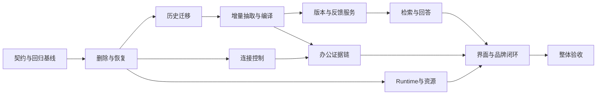

# 知迹 · Local Brain 首版正确性修复计划

<!-- doc-covers: none -->

> 基于 `5fcacf6b1a51bfaa0003e9e9907b608e80bad568` 的实现审查。目标是兑现原首版闭环，不增加生态范围。本轮只生成计划；`approved` 表示修复范围已依据用户指令收口，不表示节点已完成或已开始 Build。

## 1. 为什么需要本次迭代

已有 DB、Worker、CLI 适配、知识审核、FTS、问答和 MCP 的基础实现。主要差距在跨模块的一致性：删除后的正文仍在、恢复不重放、发布版本身份混用、引用/过滤未生效、连接控制和审核闭环不完整。不能仅把剩余工作归结为安装 CLI、补权限或做 U12 样本验证。

审查结果见 [实施质量报告](../reviews/personal-brain-implementation-readiness.yaml)：37 项逐项映射，25 项存在实现不符合、5 项仅有部分证据、7 项正式评测未完成。这是验收状态，不是开发完成率。10 个合成契约反例均已复现，正常检索对照通过；[源码和结果](../reviews/evidence/personal-brain-implementation-review/)可直接作为回归起点。

继续复用已落地模块，先修复会丢失、复活或误用资料的路径，再完成可用闭环。无需重做规划前办公调研，也不要求先拿到真实授权样本才能开始隔离测试与实现修复。

## 2. 不变的范围与完成标准

- 只接飞书消息/文档和腾讯会议转写/纪要，操作留在主侧栏「连接」。默认手动，自动同步显式启用，只读已选范围。
- 保留知迹品牌；技术 ID、包名、URL、协议、存储键和上游署名按约定保留。
- 按 2026-09-08 用户决定复用选中 AI 预设并允许手动切换 Runtime（含既有 ACP），不恢复固定 DeepSeek 限制，不新增费用或每日调用总量否决阈值。
- 来源支持、只检索本地、取消/删除清理和凭据仅 Keychain 引用仍须兑现。F01 明确各 Runtime 能实现的受限能力；能力不足返回具名不可用，不静默换模型，也不把选择 ACP 本身视为违规。
- 历史保全、首次启用后新增优先、显式 7 天回填、三种知识类型、自审发布、纠错和完整删除沿用原 PRD。WPS、向量、外部 MemoryProvider、国内 Runtime 新适配、全账号历史导入、办公写操作继续后置。
- 完成条件：本文 11 个节点证据齐备，原 37 项逐项通过或由用户明确接受具名风险；未测不能算通过。真实数据与秘密不进 git，最终仍以原 PRD §8 为质量阈值真源。

## 3. DAG、执行顺序与共用文件



依赖最长链为 `F01 → F02 → F03 → F04 → F05 → F06 → F10 → F11`，不据节点数估工期。默认实际顺序 `F01…F11`，单人/单 writer 串行；优先 F02 的删除反例和 F05 的事务反例。F07/F09 在依赖上可提前，但当前计划不启用并发写。

DB schema、来源状态、任务、Brain REST、连接和 frontend DTO 存在直接/间接共享。路径归一化后确认有交集，因此选 `serial_shared_writer`；UI 尾段用 `serial_same_worktree`。不为表面并行拆出重复类型或多个 SQLite writer。

## 4. 公共节点契约

每节点继承下列字段，节点字段仅补充/收窄。完整文件 hash 在交接时计算，不写回自身，避免循环。`source_hash` 是 frontmatter.source_artifacts 的 UTF-8、键排序、紧凑 JSON SHA-256。未来开工先核对当前 HEAD/工作区漂移；不得回退到此基线覆盖其他开发。本次审查末尾已发现 pi.rs 与 brain-tools 扩展的其他未提交改动，未纳入本轮证据，F01/F09 必须重新核对并吸收其影响。
```yaml
node_defaults:
  plan_id: plan-personal-brain-correctness
  source_plan_sha256: resolved_from_complete_plan_at_handoff
  base_commit: 5fcacf6b1a51bfaa0003e9e9907b608e80bad568
  task_id: null
  source_task_pack_sha256: null
  source_artifacts: inherit_frontmatter_source_artifacts
  source_hash: c0f1e9a77e3c3e5fc2144bb4d317a0fb363665c6f3d95b9bae9140dc148f4586
  actor: local_lead
  parallel_mode: serial_shared_writer
  required_skills:
  - agent-brain
  - codebase-analysis
  required_capabilities:
  - Rust/SQLx/TypeScript 仓库读写
  - 隔离夹具与故障注入测试
  forbidden_writes:
  - 当前节点 write_ownership 之外的文件及无关现有改动
  - .git/**、真实用户 SQLite/store、全局 CLI 认证文件、真实办公/模型密钥、保留验收答案
  - 原始采集/编码热循环、WPS/新 Runtime/向量/外部 MemoryProvider 实现
  - 发布指针、发布标签、全局 MCP 覆盖、远程 push；没有单独授权不执行外发
  - 既有已部署 migration 内容；修正 schema 一律新增增量 migration
  evidence_required:
  - 节点 ID、实际 git_head、当前计划/source hash、精确 changed_files
  - 实际命令、exit_code、执行测试数、通过/失败/未测及原因；零测试匹配不算通过
  - 反例修复前后断言、持久状态和重启结果；mock/合成/真实证据明确区分
  - 由 Task Pack 指定 node-evidence/<unit-id>.json 路径；仅脱敏摘要/合成夹具进 git
  source_review: docs/reviews/personal-brain-implementation-readiness.yaml
```

同一节点需要修改额外公共文件、绑定或依赖时，先更新本计划所有权与 hash，再由单 writer 修改。已有反例源码在文档区，开工时转为正常回归测试；审查时故意保留的失败结果不是完成证据。

## 5. 节点执行契约

### F01 · 固定修复契约与可执行回归基线

```yaml
inherits: node_defaults
plan_unit_id: F01
depends_on: []
resolves:
- DR-LIFECYCLE-001
- DR-HISTORY-001
- DR-EXTRACT-001
- DR-KNOWLEDGE-001
- DR-RETRIEVAL-001
- DR-ANSWER-001
- DR-OFFICE-001
- DR-OFFICE-002
- DR-RUNTIME-001
- DR-REVIEW-001
- DR-BRAND-001
- DR-VERIFY-001
acceptance_ids:
- AC-R1-01
- AC-R1-02
- AC-R1-03
- AC-R1-04
- AC-R2-01
- AC-R2-02
- AC-R2-03
- AC-R3-01
- AC-R3-02
- AC-R3-03
- AC-R4-01
- AC-R5-01
- AC-R5-02
- AC-R5-03
- AC-R6-01
- AC-R6-02
- AC-R6-03
- AC-R6-04
- AC-R7-01
- AC-R7-02
- AC-R8-01
- AC-R8-02
- AC-R8-03
- AC-R9-01
- AC-R9-02
- AC-R9-03
- AC-R9-04
- AC-R11-01
- AC-R11-02
- AC-R11-03
- AC-EVAL-01
- AC-EVAL-02
- AC-EVAL-03
- AC-EVAL-04
- AC-EVAL-05
- AC-EVAL-06
- AC-EVAL-07
write_ownership:
- docs/trd/personal-brain-local-first.md
- docs/prd/personal-brain-local-first.md
- docs/plans/personal-brain-correctness-execution-plan.md
- crates/screenpipe-db/src/db/brain/types.rs
- crates/screenpipe-engine/src/brain/types.rs
- crates/screenpipe-connect/src/office/types.rs
- apps/screenpipe-app-tauri/lib/brain/types.ts
- apps/screenpipe-app-tauri/lib/connections/office-types.ts
- crates/screenpipe-engine/tests/brain_correctness.rs
- crates/screenpipe-db/tests/brain_correctness.rs
mutex:
- brain-contracts
- dto
- test-fixtures
parallel_mode: serial_shared_writer
required_skills:
- agent-brain
- codebase-analysis
- write-trd
```

1. 核对 current_version_row_id 与 version、source/current revision、连接/范围 revision、删除 epoch 和任务提交条件；在 TRD 中明确数据关系。历史 plan 身份不重写。
2. 将 P01–P10 反例及 P11 对照转成隔离测试；按后续节点分组。补并发删除/提交、未启用/首次启用、迁移 coverage 和连接暂停的失败夹具。开发期允许这些断言先红，禁止通过弱化 AC 让它们变绿。
3. 把模型变更注记整理为一致的有效条款：选择与能力限制分开，Pi/ACP 各自怎样满足仅用本地输入、超时和受管输出清理明确可测；不引入新 Runtime 适配。

验证检查点（新增测试过滤词由 F01/责任节点落实，必须匹配实际测试）：

- cargo test -p screenpipe-engine --test brain_correctness -- --nocapture（新增套件；输出逐例基线，预期仍有对应失败）
- cargo test -p screenpipe-db --test brain_correctness -- --nocapture（新增套件）
- 校验 37 项与 F01–F11 映射、DTO/错误码兼容及计划 hash。

交接信号：每个缺陷有准确失败断言或具名完整调用链；公共身份及提交条件定稿，后续无需猜测状态语义。

### F02 · 完成删除、恢复、retention 和受管正文清理

```yaml
inherits: node_defaults
plan_unit_id: F02
depends_on:
- F01
resolves:
- DR-LIFECYCLE-001
- DR-ANSWER-001
acceptance_ids:
- AC-R1-02
- AC-R1-03
- AC-R2-03
- AC-R3-02
- AC-R4-01
- AC-R5-03
- AC-R6-01
- AC-R6-02
- AC-R6-03
- AC-R7-02
- AC-R9-02
- AC-R9-03
write_ownership:
- crates/screenpipe-db/src/db/brain/
- crates/screenpipe-db/src/db/maintenance.rs
- crates/screenpipe-db/src/db/activity_ledger.rs
- crates/screenpipe-db/src/db/memories.rs
- crates/screenpipe-db/src/migrations/*brain*.sql
- crates/screenpipe-engine/src/brain/deletion.rs
- crates/screenpipe-engine/src/brain/sources.rs
- crates/screenpipe-engine/src/brain/knowledge.rs
- crates/screenpipe-engine/src/routes/data.rs
- crates/screenpipe-engine/src/routes/memories.rs
- crates/screenpipe-engine/src/retention.rs
- crates/screenpipe-core/src/memories/external_sync.rs
- crates/screenpipe-engine/tests/brain_correctness.rs
- crates/screenpipe-db/tests/brain_correctness.rs
mutex:
- sqlite-schema
- db-writer
- deletion-barrier
parallel_mode: serial_shared_writer
```

1. 构建受协调 writer 管理的提交检查/删除事务：来源→Work Unit→全部知识版本→回答/claims/反馈/history→索引/受管文件/会话登记。显式删除擦除复制正文，保留无正文身份与墓碑；原始范围删除、memory、办公 erase 统一进入此链。
2. journal fsync 后持久化一致序号；启动先比较 DB 与 journal，再提供读/写服务。恢复“journal 已写 DB 未提交、DB 提交文件未清、旧备份回退、并发删除、损坏尾行”；不得直接把未完成项置 completed。单文件失败保持待重试且可重启恢复。
3. 统一 office_object 和 source_locator 墓碑语义，保持账号隔离与重连抑制；旧数据修复不得重新暴露已删正文。
4. retention 删除前计算发布引用文本豁免，多知识共享引用最后释放才可清理；媒体可删除，归档引用有可核验摘录和真实状态。普通数据删除不得依赖原文删完后的事后补偿。

验证检查点（新增测试过滤词由 F01/责任节点落实，必须匹配实际测试）：

- cargo test -p screenpipe-engine --test brain_correctness deletion -- --nocapture
- cargo test -p screenpipe-db --test brain_correctness deletion -- --nocapture
- 临时目录注入 remove 失败、journal/DB 故障点和旧备份恢复；扫描原始/派生表、FTS 和受管文件，命中数必须为 0。
- 覆盖 frame/audio/ui_event/memory/office 五类；P01/P02/P09 通过，retention 发布豁免与共享释放符合 PRD 矩阵。

交接信号：删除成功确实没有受影响正文可读/可重建/可重导；文件失败不假完成；新持久正文只能走受保护存储接口。

### F03 · 历史迁移接管唯一读写来源

```yaml
inherits: node_defaults
plan_unit_id: F03
depends_on:
- F02
resolves:
- DR-HISTORY-001
acceptance_ids:
- AC-R1-04
- AC-R6-02
- AC-R8-03
write_ownership:
- apps/screenpipe-app-tauri/src-tauri/src/brain_migration.rs
- apps/screenpipe-app-tauri/src-tauri/src/activity_history.rs
- crates/screenpipe-engine/src/brain/migration.rs
- crates/screenpipe-db/src/db/brain/history.rs
- crates/screenpipe-db/src/db/brain/state.rs
- crates/screenpipe-db/src/migrations/*brain*.sql
- crates/screenpipe-engine/tests/brain_correctness.rs
- crates/screenpipe-db/tests/brain_correctness.rs
mutex:
- history-writer
- desktop-lifecycle
- db-writer
parallel_mode: serial_shared_writer
```

1. 先暂停/排空旧 writer 再取稳定快照，逐项 ID+不改变字符串正文的摘要对照；coverage 逐区间、边界完整比较，不以条数下限替代。
2. 保持加密历史保护级别，Keychain 不可用暂停；验证后原子切换读写到 Brain，旧 store 只作为受控可清理回退副本。离线新条目必须有可重放的持久写入，禁止只有 best-effort 镜像。
3. 所有迁移/恢复/回退先应用 F02 删除记录；active、enabled_at 和保全迁移状态分离，不因导入旧记录而触发旧数据 AI 重算。

验证检查点（新增测试过滤词由 F01/责任节点落实，必须匹配实际测试）：

- cargo test -p screenpipe-engine --test brain_correctness migration -- --nocapture
- cargo test -p screenpipe-db --test brain_correctness migration -- --nocapture
- 桌面目录：bun run test:tauri brain_migration -- --nocapture（新增纯夹具测试，经队列/cache）；覆盖不同 entry/span 数、同数不同区间、正文空白、切换点失败、加密 key 不可用。

交接信号：新旧对照一致且 read_all/write_all 真正消费切换状态；断网/崩溃不丢条目，历史查看与 AI 启用边界分离。

### F04 · 修复增量任务、来源引用与三类知识编译

```yaml
inherits: node_defaults
plan_unit_id: F04
depends_on:
- F03
resolves:
- DR-EXTRACT-001
acceptance_ids:
- AC-R1-01
- AC-R1-02
- AC-R1-03
- AC-R1-04
- AC-R2-01
- AC-R6-02
- AC-R8-01
- AC-R8-02
- AC-R8-03
- AC-R9-03
- AC-EVAL-02
write_ownership:
- crates/screenpipe-engine/src/brain/extract.rs
- crates/screenpipe-engine/src/brain/compile.rs
- crates/screenpipe-engine/src/brain/sources.rs
- crates/screenpipe-engine/src/brain/registry/
- crates/screenpipe-engine/src/brain/prompts/
- crates/screenpipe-engine/src/brain/migration.rs
- crates/screenpipe-db/src/db/brain/work_units.rs
- crates/screenpipe-db/src/db/brain/jobs.rs
- crates/screenpipe-db/src/db/brain/knowledge.rs
- crates/screenpipe-db/src/db/brain/state.rs
- crates/screenpipe-db/src/migrations/*brain*.sql
- apps/screenpipe-app-tauri/src-tauri/src/brain_runtime.rs
- crates/screenpipe-engine/tests/brain_correctness.rs
mutex:
- db-writer
- brain-jobs
- knowledge-registry
- desktop-lifecycle
parallel_mode: serial_shared_writer
```

1. 按 enabled/enabled_at、final 稳定区间和持久 checkpoint 发现新增；任务身份含区间、来源修订、人工分类和抽取器/模型身份。同 scope 不同会话不能被合并，同输入重启不重复模型调用；停机超过 26 小时仍可续接。
2. 修复 ui_events/AX 来源表映射和实际时间/应用元数据；eN/uN 字段引用映射与精确 revision 随正文保存；使用 F02 的原子提交接口把产物、依赖和 job 完成一起提交。模型返回后的 cancel/lease/revision/deletion 不通过则全部丢弃。
3. 显式回填只覆盖所选近 7 天，跨界区间规则可核验；稳定流程 scope 与每个会话身份分离。单次 DecisionRule/ExceptionPlaybook 允许带边界产生；SOP 的三个独立会话和步骤/条件/异常依据从输入计算。
4. 输入 hash 使用 Work Unit 当前修订及真实 prompt/schema/model 身份；编译前消费驳回抑制，重复输入不再新增候选；拒绝空步骤及没有支持的事实字段。

验证检查点（新增测试过滤词由 F01/责任节点落实，必须匹配实际测试）：

- cargo test -p screenpipe-engine --test brain_correctness extraction -- --nocapture
- cargo test -p screenpipe-db --test brain_correctness jobs -- --nocapture
- 覆盖启用前/跨界/迟到/分拆合并/分类变化、同标题不同区间、停机 48 小时、模型返回瞬间删除/失租约；P10 通过。
- 同输入重跑/驳回无新增，修订输入有新候选；三个独立会话与单次规则各有成功对照。

交接信号：范围、进度、产物一致，取消或删除无旧正文提交；引用能跨重启还原，三类候选门槛分别成立。

### F05 · 修复知识版本、原子审核与反馈定位服务

```yaml
inherits: node_defaults
plan_unit_id: F05
depends_on:
- F04
resolves:
- DR-KNOWLEDGE-001
- DR-REVIEW-001
acceptance_ids:
- AC-R2-02
- AC-R2-03
- AC-R5-03
- AC-R7-01
- AC-R7-02
write_ownership:
- crates/screenpipe-db/src/db/brain/knowledge.rs
- crates/screenpipe-db/src/db/brain/work_units.rs
- crates/screenpipe-db/src/db/brain/feedback.rs
- crates/screenpipe-db/src/migrations/*brain*.sql
- crates/screenpipe-engine/src/brain/knowledge.rs
- crates/screenpipe-engine/src/brain/routes.rs
- crates/screenpipe-engine/src/brain/types.rs
- apps/screenpipe-app-tauri/lib/brain/types.ts
- crates/screenpipe-engine/tests/brain_correctness.rs
- crates/screenpipe-db/tests/brain_correctness.rs
mutex:
- sqlite-schema
- db-writer
- knowledge-state
- brain-router
- dto
parallel_mode: serial_shared_writer
```

1. 统一知识 row ID/版本号并对已有错误指针做增量修复；发布候选、旧版 supersede、指针/epoch 更新在一事务完成，任何 CAS 失败完全回滚。
2. 候选编辑正文与 revision 同事务；发布时按准确依赖修订、有效性、归档可核验性和 F02 删除条件重验。新事实必须有支持，不能只检查引用 ID 存在。
3. 提供从发布版创建候选修订、暂停/恢复/驳回原因和 30 天复核的明确 API；结构化定位 answer/claim→知识版本，未知关联进入可管理待处理队列；删除时反馈和历史正文服从 F02。

验证检查点（新增测试过滤词由 F01/责任节点落实，必须匹配实际测试）：

- cargo test -p screenpipe-db --test brain_correctness publication -- --nocapture
- cargo test -p screenpipe-engine --test brain_correctness review -- --nocapture
- P07/P08 必须通过；至少两条知识、三轮版本、并发编辑/发布和失败回滚；发布瞬间删来源不得成功。
- 证明 v1 已发布/v2 待审期间 v1 可用，v2 发布后只引用 v2；到期/暂停的服务端语义明确。

交接信号：版本身份不再歧义，失败操作不伤当前版；反馈、修订、自审服务足以支持完整 UI 闭环。

### F06 · 检索、回答和 MCP 共用当前证据规则

```yaml
inherits: node_defaults
plan_unit_id: F06
depends_on:
- F05
resolves:
- DR-RETRIEVAL-001
- DR-ANSWER-001
- DR-VERIFY-001
acceptance_ids:
- AC-R3-01
- AC-R3-02
- AC-R3-03
- AC-R4-01
- AC-R5-01
- AC-R5-02
- AC-R5-03
- AC-R7-01
- AC-EVAL-03
write_ownership:
- crates/screenpipe-engine/src/brain/search.rs
- crates/screenpipe-engine/src/brain/answer.rs
- crates/screenpipe-engine/src/brain/routes.rs
- crates/screenpipe-engine/src/brain/prompts/
- crates/screenpipe-db/src/db/brain/search.rs
- crates/screenpipe-db/src/db/brain/feedback.rs
- crates/screenpipe-db/src/db/brain/sources.rs
- crates/screenpipe-db/src/text_normalizer.rs
- crates/screenpipe-db/src/migrations/*brain*.sql
- packages/screenpipe-mcp/src/
- packages/screenpipe-mcp/tests/
- packages/screenpipe-mcp/README.md
- crates/screenpipe-engine/tests/brain_correctness.rs
mutex:
- search-contracts
- brain-router
- mcp-contracts
- db-writer
parallel_mode: serial_shared_writer
```

1. 来源、memory、知识三路统一当前修订/状态、应用/时间/来源种类过滤；到期、暂停、disabled、已删、切版均及时失效。对原始采集与办公事件分别使用真实发生时间，不用抓取时间补未知。
2. 明确 disabled/no_hits/timeout/failed/ok 与部分/全部失败；FTS 故障不得吞成零命中。保持旧 /search 的默认排序、升序、分页、过滤和空结果契约。
3. 拒绝空/缺失/伪造/不支持结论的引用；仅从已核验 claims 生成可见 answer，失效声明不能放到 uncertainty 泄漏。返回/保存前再验 source revision 与知识 publication epoch，memory 引用也可通过统一来源接口核验。
4. 幂等键绑定问题、filters、运行身份与有效性 epoch，缓存返回完整相同结果；正文、依赖、TTL 和保存状态通过 DatabaseManager 原子操作并实际回收。
5. REST/MCP 同错误及引用规则；为 answer/get-brain-source 新工具补调用、删除、版本变更和包装分发测试，提供可复用连接说明，不能只留下某台机器的绝对路径手工注册。

验证检查点（新增测试过滤词由 F01/责任节点落实，必须匹配实际测试）：

- cargo test -p screenpipe-engine --test brain_correctness retrieval -- --nocapture
- cargo test -p screenpipe-engine --test brain_correctness answer -- --nocapture
- cargo test -p screenpipe-db --test brain_correctness search_compatibility -- --nocapture（新增旧契约夹具）
- MCP 目录：bun run test；bun run typecheck；新工具用例必须被实际选中。
- P03–P06/P11 全绿；伪造、真实但不支持、无证据、冲突、过期、注入、生成中删除/切版、同 key 不同问题和缓存过期有成功/失败对照。

交接信号：每个可见事实有当前可核验引用，检索失败与无证据明确区分；保存、缓存、REST 和 MCP 一致。

### F07 · 连接中的依赖/授权和同步控制闭环

```yaml
inherits: node_defaults
plan_unit_id: F07
depends_on:
- F02
resolves:
- DR-OFFICE-001
acceptance_ids:
- AC-R6-01
- AC-R6-04
- AC-R9-01
- AC-R9-02
- AC-R9-04
write_ownership:
- crates/screenpipe-connect/src/office/runner.rs
- crates/screenpipe-connect/src/office/types.rs
- crates/screenpipe-connect/src/office/feishu.rs
- crates/screenpipe-connect/src/office/tencent_meeting.rs
- crates/screenpipe-engine/src/brain/office.rs
- crates/screenpipe-engine/src/brain/office_routes.rs
- crates/screenpipe-db/src/db/brain/office.rs
- crates/screenpipe-db/src/db/brain/jobs.rs
- crates/screenpipe-db/src/migrations/*brain*.sql
- apps/screenpipe-app-tauri/src-tauri/src/office_runtime.rs
- apps/screenpipe-app-tauri/lib/connections/office.ts
- apps/screenpipe-app-tauri/lib/connections/office-types.ts
- crates/screenpipe-engine/tests/brain_correctness.rs
- crates/screenpipe-connect/tests/office_lifecycle.rs
mutex:
- office-contracts
- db-writer
- office-router
- desktop-lifecycle
- dto
parallel_mode: serial_shared_writer
```

1. 复用已支持的官方 CLI 探测/安装机制和用户发起的正式登录路径；缺依赖/缺 scope/账号不支持分别呈现。认证流程真实启动并能轮询完成，不能以 refresh 冒充 authorize。使用专用受限动作，不开放任意代理。
2. 控制粒度固定 provider+account+job；暂停/恢复/重试/断开状态持久化，重启继续有效，暂停飞书不得取消腾讯会议。自动同步使用持久游标和推进窗口，不能反复同步固定旧窗口。
3. 使用聊天→消息、文档、会议→录制资源关系计算范围；停用传播到来源、知识和检索。断开 retain_inactive 使用真实账号，erase 进入 F02；不注销/升级用户全局 CLI 登录。
4. 每页提交重验当前账号、connection/scope revision、取消/删除 epoch；对象、索引、映射、游标同事务或可恢复一致操作，范围变更后旧页不能落库。

验证检查点（新增测试过滤词由 F01/责任节点落实，必须匹配实际测试）：

- cargo test -p screenpipe-connect --test office_lifecycle -- --nocapture（新增 fake CLI 集成套件）
- cargo test -p screenpipe-engine --test brain_correctness office_control -- --nocapture
- 覆盖依赖缺失/授权失效/切号/限流/离线/分页中断、取消同时返回、缩范围、断开重连、两个 provider 同时有任务；测试真实状态而非仅按钮。

交接信号：全部连接操作有真实服务实现且可跨页/重启保留；没有范围外提交、跨 provider 误取消或删除复活。

### F08 · 办公正文、时间回链与活动关联

```yaml
inherits: node_defaults
plan_unit_id: F08
depends_on:
- F04
- F07
resolves:
- DR-OFFICE-002
acceptance_ids:
- AC-R1-01
- AC-R2-01
- AC-R9-01
- AC-R9-02
- AC-R9-03
- AC-EVAL-02
- AC-EVAL-07
write_ownership:
- crates/screenpipe-connect/src/office/feishu.rs
- crates/screenpipe-connect/src/office/tencent_meeting.rs
- crates/screenpipe-connect/src/office/types.rs
- crates/screenpipe-connect/tests/fixtures/office/
- crates/screenpipe-connect/tests/office_content.rs
- crates/screenpipe-engine/src/brain/office.rs
- crates/screenpipe-engine/src/brain/extract.rs
- crates/screenpipe-engine/src/brain/sources.rs
- crates/screenpipe-db/src/db/brain/office.rs
- crates/screenpipe-db/src/db/brain/sources.rs
- crates/screenpipe-db/src/db/brain/search.rs
- crates/screenpipe-db/src/migrations/*brain*.sql
- crates/screenpipe-engine/tests/brain_correctness.rs
mutex:
- office-contracts
- knowledge-registry
- search-contracts
- db-writer
parallel_mode: serial_shared_writer
```

1. 保存真实会议/录制/段落身份、事件时间、段落时间锚和可安全打开的来源链接；未知保持未知，不能把 scope 起始时间当会议时间。原始转写与平台 AI 纪要分源。
2. 飞书文档/消息和会议段落采用有界可核验正文块，长文后段命中能查看对应片段；重建和增量索引保持同样覆盖与删除语义，不以 2000 字摘录重建替代全文索引。
3. 只有明确会议/消息/文档活动锚匹配到 final 会话的办公来源才进入 Work Unit；可访问但未使用的资料留作检索。复用 F04 稳定身份串联跨工具重复流程。

验证检查点（新增测试过滤词由 F01/责任节点落实，必须匹配实际测试）：

- cargo test -p screenpipe-connect --test office_content -- --nocapture（新增脱敏分页/长文/时间夹具）
- cargo test -p screenpipe-engine --test brain_correctness office_evidence -- --nocapture
- 合成跨工具流程完成来源→Work Unit→SOP 草稿→发布→问答→删除；活动/仅资料正反对照，长文后段重建前后检索一致。
- 真实两工具版本/权限及转写时间回链留 F11 验收；没有云转写时记不可用，不用截图或 AI 纪要冒充。

交接信号：办公内容既可检索也可按确凿活动证据参与沉淀，来源时间/身份/回链逐项可核验。

### F09 · Runtime 持久预算、凭据与取消清理

```yaml
inherits: node_defaults
plan_unit_id: F09
depends_on:
- F02
resolves:
- DR-RUNTIME-001
acceptance_ids:
- AC-R6-04
- AC-R8-01
- AC-R8-02
- AC-EVAL-06
write_ownership:
- crates/screenpipe-engine/src/brain/executor.rs
- crates/screenpipe-engine/src/brain/worker.rs
- crates/screenpipe-engine/src/brain/answer.rs
- crates/screenpipe-db/src/db/brain/jobs.rs
- crates/screenpipe-db/src/db/brain/state.rs
- crates/screenpipe-db/src/migrations/*brain*.sql
- apps/screenpipe-app-tauri/src-tauri/src/brain_runtime.rs
- apps/screenpipe-app-tauri/src-tauri/src/pi.rs
- apps/screenpipe-app-tauri/src-tauri/src/store.rs
- apps/screenpipe-app-tauri/src-tauri/src/main.rs
- crates/screenpipe-engine/tests/brain_correctness.rs
mutex:
- pi-executor
- desktop-lifecycle
- db-writer
- model-secrets
parallel_mode: serial_shared_writer
```

1. 沿用当前 preset/Runtime 选择，执行时冻结真实模型、provider、Pi/Runtime 版本和 profile；凭据由 Keychain 引用解析，不把值持久在新增 Brain 状态/日志/会话。需要修正已有 preset 存储时限定相关键的兼容迁移，保留其他设置。
2. 任务模型调用数跨进程/重试累计，非法 JSON 重试计入最多三次；未配置每日预算保持无限制。配置错误转可恢复暂停，修复预设后继续；超时、排队、输入上下文按 TRD 限制执行。
3. 交互与后台共享明确的资源限制/公平调度，长任务不能无限阻塞 Ask；请求取消、删除、失租约和退出统一传播，使用可在 future drop/启动失败后清理的进程管理与目录守卫。
4. 启动恢复先清理旧受管会话再运行任务；取消需 kill/reap（终止并回收子进程）以及持久清理重试，不能只取消 Rust future 后留下 CLI。Pi/ACP 分别验证，能力不足报明确错误。

验证检查点（新增测试过滤词由 F01/责任节点落实，必须匹配实际测试）：

- cargo test -p screenpipe-engine --test brain_correctness runtime -- --nocapture
- 桌面目录：bun run test:tauri brain_runtime -- --nocapture（新增 fake sidecar/Keychain 测试，必须走 native queue/cache）
- 故障点包括启动失败、排队超时、执行超时、取消、退出重启、断网恢复、租约失效、模型切换；跨三轮重试累计调用不得超过三次。
- 检查受管文件/子进程和日志，不打印密钥；真实所选模型调用与资源指标在 F11 有条件实测，不能用 mock 替代。

交接信号：选中 Runtime 的实际执行身份可审计；取消/退出无旧结果或受管正文残留；资源预算与暂停/恢复状态跨重启一致。

### F10 · 完成知识审核、Ask、连接和知迹品牌界面

```yaml
inherits: node_defaults
plan_unit_id: F10
depends_on:
- F05
- F06
- F07
- F08
- F09
resolves:
- DR-REVIEW-001
- DR-BRAND-001
acceptance_ids:
- AC-R2-02
- AC-R2-03
- AC-R5-01
- AC-R7-01
- AC-R7-02
- AC-R8-03
- AC-R9-04
- AC-R11-01
- AC-R11-02
- AC-R11-03
- AC-EVAL-05
write_ownership:
- apps/screenpipe-app-tauri/components/brain/
- apps/screenpipe-app-tauri/lib/brain/
- apps/screenpipe-app-tauri/components/settings/office-connection-card.tsx
- apps/screenpipe-app-tauri/components/settings/feishu-connection-panel.tsx
- apps/screenpipe-app-tauri/components/settings/tencent-meeting-connection-panel.tsx
- apps/screenpipe-app-tauri/components/settings/connections-section.tsx
- apps/screenpipe-app-tauri/components/settings/brain-section.tsx
- apps/screenpipe-app-tauri/components/settings/__tests__/
- apps/screenpipe-app-tauri/lib/brand.ts
- apps/screenpipe-app-tauri/lib/connections/
- crates/screenpipe-engine/src/brain/routes.rs
- docs/reviews/personal-brain-brand-retained-identifiers.md
mutex:
- brain-ui
- connections-ui
- frontend-brand
- brain-router
parallel_mode: serial_same_worktree
required_capabilities:
- React/TypeScript
- 本机浏览器操作与无障碍行为测试
```

1. 编辑状态绑定具体 candidate row/version/revision，不能借用当前发布版；实现从发布版创建 v2、来源对照、自审、驳回/恢复原因、到期复核和待处理反馈。
2. Ask 的逐项引用能打开对应来源/知识版本及时间锚，反馈能定位并暂停错误版；数据删除/切版事件后及时清除页面旧详情和答案正文。
3. “连接”调用 F07 完整流程，同步进行中仍可取消；离页/重启展示服务端状态。回填可暂停/取消/恢复，迁移/新增/回填分开；status 真实计算 coverage、积压、到期和清理失败，去掉占位 0/None。
4. 修复 Screenpipe 产物预填文案及过期断言，按品牌常量和具名保留清单核对可见路径。先定位精确品牌残留再扩充当前允许文件，禁止机械全仓替换或批量更新快照。

验证检查点（新增测试过滤词由 F01/责任节点落实，必须匹配实际测试）：

- 桌面目录：bun x vitest run --config vitest.config.ts components/brain components/settings/__tests__/office-connection-card.test.tsx components/settings/__tests__/brain-section.filter.test.tsx components/settings/__tests__/brain-overview.test.tsx（新测试落点以此冻结）
- 桌面目录：bun run typecheck；browser-mock 完整执行“有误反馈→暂停 v1→编辑 v2→自审→再次提问只用 v2”。
- browser-mock 覆盖连接授权/取消/重试/断开、回填恢复、错误/空/归档/清理失败态；验证焦点、键盘和可访问名称。
- 品牌扫描+具名例外+主要页面画面证据；83/1 的旧前端测试失败应精确修正，新增 UI 核心行为也必须有测试。

交接信号：用户能不依赖 SQL/命令行完成连接、审核、纠错与回填控制；界面所示状态等于实际服务状态。

### F11 · 原 37 项完整回归与真实工作流验收

```yaml
inherits: node_defaults
plan_unit_id: F11
depends_on:
- F10
resolves:
- DR-VERIFY-001
acceptance_ids:
- AC-R1-01
- AC-R1-02
- AC-R1-03
- AC-R1-04
- AC-R2-01
- AC-R2-02
- AC-R2-03
- AC-R3-01
- AC-R3-02
- AC-R3-03
- AC-R4-01
- AC-R5-01
- AC-R5-02
- AC-R5-03
- AC-R6-01
- AC-R6-02
- AC-R6-03
- AC-R6-04
- AC-R7-01
- AC-R7-02
- AC-R8-01
- AC-R8-02
- AC-R8-03
- AC-R9-01
- AC-R9-02
- AC-R9-03
- AC-R9-04
- AC-R11-01
- AC-R11-02
- AC-R11-03
- AC-EVAL-01
- AC-EVAL-02
- AC-EVAL-03
- AC-EVAL-04
- AC-EVAL-05
- AC-EVAL-06
- AC-EVAL-07
write_ownership:
- docs/reviews/personal-brain-correctness-acceptance.md
- docs/reviews/personal-brain-correctness-readiness.yaml
- docs/reviews/evidence/personal-brain-correctness/
- docs/roadmap.md
- docs/plans/personal-brain-correctness-execution-plan.md
- apps/screenpipe-app-tauri/e2e/specs/local-brain*.spec.ts
- crates/screenpipe-engine/tests/brain_correctness.rs
- crates/screenpipe-db/tests/brain_correctness.rs
- crates/screenpipe-connect/tests/office_lifecycle.rs
- crates/screenpipe-connect/tests/office_content.rs
- packages/screenpipe-mcp/tests/
mutex:
- acceptance-snapshot
- release-measurement
parallel_mode: serial_same_worktree
required_skills:
- agent-brain
- delivery-readiness
- screenpipe-api
- screenpipe-cli
required_capabilities:
- 本机桌面与浏览器
- 真实授权样本的本地隔离处理
- 人工事实/可用性评测
```

1. 先冻结修复候选 HEAD、完整源码/计划 hash 和各节点证据，运行合成全链及兼容测试；保留本轮原始审查，不覆盖成“当时已通过”。
2. 冻结 ≥10 真实开发会话（≥3 同流程）、30–50 保留查询、两款 CLI/账号能力和实际所选模型/Runtime；调试集与保留集分开，失败项计入分母，真实材料仅放本地受控目录。
3. 完成需求分析/调研/业务沟通中的至少一条跨工具链：导入→活动关联→SOP v1→纠错 v2→再次问答→来源删除；两工具关键内容正确导入且可检索分别 ≥90%，腾讯会议含真实转写和时间回链。
4. 按 PRD §8 记录事实支持 ≥90%、至少一份用户认可 SOP、保留集无无支持事实、可回答题正确实质回答 ≥80%，以及原资源/SLA、5 工作日审核负担和出口。无真实样本的条目记未测，不用全拒答/全抑制候选达标。
5. 实际检查 REST/MCP 新工具分发、错误、修订/删除，旧 /search、memory、文件出口和品牌回归。缺陷回归所属节点修复，不在验收节点扩大代码所有权；全部关闭后再改 completed/roadmap。

验证检查点（新增测试过滤词由 F01/责任节点落实，必须匹配实际测试）：

- 根目录：cargo test -p screenpipe-db --lib brain；cargo test -p screenpipe-engine --lib brain；cargo test -p screenpipe-connect --lib office
- 根目录：cargo test -p screenpipe-db --test brain_correctness；cargo test -p screenpipe-engine --test brain_correctness；cargo test -p screenpipe-connect --test office_lifecycle --test office_content
- MCP 目录：bun run test；bun run typecheck；桌面目录相关 Vitest 与 bun run typecheck；原生边界只用 bun run test:tauri。
- 原 PRD 37 项逐项证据表：passed/failed/unverified/accepted_risk，accepted_risk 必须记用户、理由、范围及复查条件；没有新修改/失败不反复扩大测试。

交接信号：37 项有真实证据或用户具名接受的风险，implementation_to_verify 再评估可过；未满足则保持进行中，不发布、不推送。

## 6. 验收映射和证据口径

原 PRD 是验收阈值真源，报告是本轮问题真源，本文是修复次序真源。每个责任节点继承原 AC，F11 汇总而不替代局部契约测试。新增 P01–P11 是回归案例，不增加或替换 37 项产品验收分母。

| 原验收 | 修复/验收节点 |
|---|---|
| AC-R1-01 | F04, F08, F11 |
| AC-R1-02 | F02, F04, F11 |
| AC-R1-03 | F02, F04, F11 |
| AC-R1-04 | F03, F04, F11 |
| AC-R2-01 | F04, F08, F11 |
| AC-R2-02 | F05, F10, F11 |
| AC-R2-03 | F02, F05, F10, F11 |
| AC-R3-01 | F06, F11 |
| AC-R3-02 | F02, F06, F11 |
| AC-R3-03 | F06, F11 |
| AC-R4-01 | F02, F06, F11 |
| AC-R5-01 | F06, F10, F11 |
| AC-R5-02 | F06, F11 |
| AC-R5-03 | F02, F05, F06, F11 |
| AC-R6-01 | F02, F07, F11 |
| AC-R6-02 | F02, F03, F04, F11 |
| AC-R6-03 | F02, F11 |
| AC-R6-04 | F07, F09, F11 |
| AC-R7-01 | F05, F06, F10, F11 |
| AC-R7-02 | F02, F05, F10, F11 |
| AC-R8-01 | F04, F09, F11 |
| AC-R8-02 | F04, F09, F11 |
| AC-R8-03 | F03, F04, F10, F11 |
| AC-R9-01 | F07, F08, F11 |
| AC-R9-02 | F02, F07, F08, F11 |
| AC-R9-03 | F02, F04, F08, F11 |
| AC-R9-04 | F07, F10, F11 |
| AC-R11-01 | F10, F11 |
| AC-R11-02 | F10, F11 |
| AC-R11-03 | F10, F11 |
| AC-EVAL-01 | F11 |
| AC-EVAL-02 | F04, F08, F11 |
| AC-EVAL-03 | F06, F11 |
| AC-EVAL-04 | F11 |
| AC-EVAL-05 | F10, F11 |
| AC-EVAL-06 | F09, F11 |
| AC-EVAL-07 | F08, F11 |

原生测试必须走仓库 native queue/cache；不可用时记录该检查未执行，继续不依赖它的工作，不走 raw cargo 回退。不会为本轮计划去启动或改写真实数据。真实权限/账号不支持仅影响相应 F11 场景，不妨碍 F01–F10 的合成测试和实现修复。

每条机器证据至少记录 command/cwd/exit_code/test_count/git_head/plan_hash/fixture_hash；UI 附状态前后与预期动作，模型评测附实际 Runtime/Preset/model 身份，不附秘密。未来使用的源文件必须当前核验，不能沿用旧执行计划已经漂移的 hash。

## 7. Remote Handoff Inputs

当前执行建议仍为同工作区串行，没有创建子任务或跨机派发。后续若用户明确委派，F06 的 MCP 测试、F08 的解析夹具可在共享 DTO 冻结后拆成专属 worktree；输入仅为该节点、TRD 对应章节、脱敏/合成夹具、allowed_paths、hash 和验证命令。共享 DB/路由/模型资源仍由单 writer 集成，不能两个节点同时改这些文件。

不得携带真实录制、会议正文、客户材料、CLI 登录文件、API key 或保留集答案。授权/Keychain、原生生命周期、桌面/浏览器和真实质量验收由本机主执行者承担。

## 8. 开工交接与结束条件

收到后续实施指令后，先核验本文件当前完整 SHA-256 和基线漂移，运行 `delivery-readiness` 的 plan_to_build 检查，由 agent-brain 创建带 plan_id/plan_unit_id/source hash 的 Task Pack，再按节点 Build/Verify/Acceptance。任务与路径由 Task Pack 收窄；本轮未创建 Task Pack，也未把实现审查 blocked 冒充计划可直接发布。

计划修改后重算完整文件 hash，更新下游引用，不把本文件的 hash 存入自身 frontmatter。F11 完成前不把“已有代码/测试通过若干”写为“首版完成”；若仍有失败或未测，记录责任节点与下一步，保留本次历史评审及反例。
