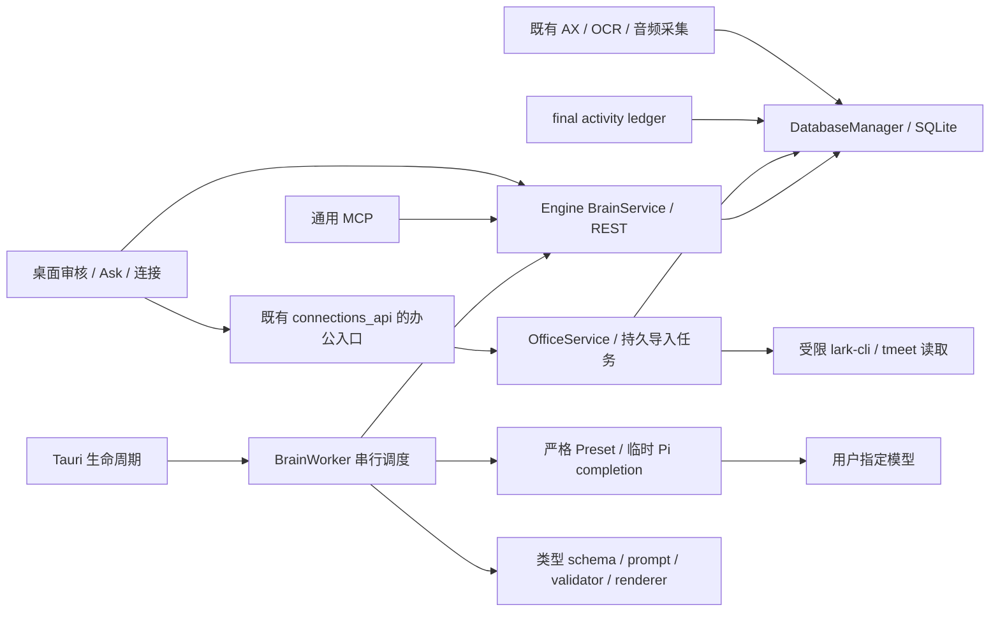

<!-- screenpipe — AI that knows everything you've seen, said, or heard -->
<!-- https://screenpipe.com -->

# TRD：知迹 · Local Brain 首版

> 按用户最新范围生成实施计划：首版只接入飞书和腾讯会议，操作统一放「连接」；WPS 后置。用户明确取消规划前接入/模型验证，旧预研缺口转入实施任务验收。本设计已收口用于规划，新增接口、表和功能尚未实现；approved 不表示验证通过。原评审保留历史快照，本轮不运行新的交接门禁。

## 1. 技术目标与边界

从真实开发工作的需求分析、调研、业务沟通中形成带证据的 Work Unit，再编译为可自审、修订、删除失效的 SOP / DecisionRule / ExceptionPlaybook。SQLite 为唯一内容与状态真源；桌面应用负责运行和用户操作；REST 与通用 MCP 共用查询与生命周期规则。

本期覆盖 PRD R1–R9、R11 的首版要求和 AC-EVAL-01…07，共 37 项验收。AC-R4-02、R10 及其四项历史验收后置；仅增加飞书/腾讯会议两个只读办公入口，不增加 WPS、国内 Runtime、双向办公操作、向量库、外部队列或全新 Agent 框架。首轮模型固定 `shawnhub-copy / deepseek-v4-flash-0731`，费用与每日调用总量不设硬上限。

历史保全迁移与 AI 重算是两件事：迁移保留所有仍有效的历史条目和 coverage；新模型任务默认只处理启用后的新增证据，历史由用户单独启动近 7 天回填。

## 2. 现状核对与组件取舍

### 2.1 已核对的约束

| 现有位置 | 当前行为 | 对设计的影响 |
|---|---|---|
| `crates/screenpipe-db/src/db/mod.rs` | 只读池、写池、写入许可与物理数据库协调；`ImmediateTx` 持有许可直至提交/回滚 | 所有新增持久化走同一 DatabaseManager，Tauri 不自行打开 SQLite 写连接 |
| `db/activity_ledger.rs` 与 ledger migration | 尾部区间/证据可能删除重建；原始来源删除触发器主要移除引用 | interval/evidence 整数 ID 不能成为永久来源；现有触发器不能单独满足整版删除 |
| Tauri `activity_history.rs` | store key `activityHistory:activity-history-pi-v9` 保存 entries/coverage，后台调用依赖 AppHandle/PiState | 保全迁移要覆盖正文和进度；任务生命周期继续由桌面应用承接 |
| Tauri `pi.rs` / core `agents/pi.rs` | 旧预研中应用 Pi 为 0.84.1，全局 Pi 实测 0.85.0；实际实现按届时锁定版本；全局目录与应用 `pi-config` 隔离；默认允许持久会话/扩展 | 复用调用基础，但必须增加严格的临时抽取配置与显式 Preset 绑定 |
| engine `local_chat.rs` | 现有 completion 代理会在指定 preset 缺失时回落默认 | `/answer` 不直接沿用该回落行为；严格解析选定 preset，失败明确返回 |
| `db/search.rs` / `text_normalizer.rs` | 原有 FTS5 unicode61；主要按空白/拉丁词拆分 | 连续中文短语存在漏召回；首版需新增独立的中文检索归一化，不改旧 `/search` 默认契约 |
| `screenpipe-semantic/src/parsers` | 已有 app/family/generic parser 链、版本与输入指纹、失败降级 | 保留现有采集降级，不以前置专用 parser 作为办公接入条件 |
| Tauri `brain_views.rs` | 现有 canvas / slot / Pipe 展示状态 | 可复用 UI 基础，不能作为知识版本数据库或另建平行编译器 |
| `packages/screenpipe-mcp` | 官方 MCP SDK 的 stdio 服务，通过认证 REST 读写，不直接读库 | 新工具共用 REST 数据形状、错误与最终引用校验 |

上表来自当前文件核对；CodeGraph 用于定位，但索引含旧路径，不能替代现行源码。此次工作区另有大量前端汉化改动；本轮规划 HEAD 为 `a255ffdf2d7a36c12a5a471eb4abe556ba14be03`，关键文件指纹在实施计划记录。旧预研的 HEAD 只代表当时证据。

新增影响面已直接核对：主页面 `app/(main)/home/page.tsx` 将「连接」作为独立 section，复用 `components/settings/connections-section.tsx`；`lib/constants/connections.ts` 维护分类。Engine `connections_api.rs` 挂载连接列表与通用代理；`screenpipe-connect/src/connections/mod.rs` 的存量凭据保存存在无 SecretStore 时的文件回退。新办公入口必须避开通用任意方法代理与凭据明文回退，不把只读接入变成通用代理。`sync_scheduler.rs` 是远程文件同步，不能直接当办公内容增量任务。

### 2.2 复用评估

| 能力 / 候选 | 选择 | 适配、维护与代价 |
|---|---|---|
| SQLite / SQLx / 既有写协调 | extend | 项目已使用，无额外服务与同步真源；复用迁移、事务和锁。SQLite 上游成熟、公共领域；Rust 依赖继续使用仓库锁文件。锁竞争、索引大小和迁移恢复由本项目验证 |
| 本地检索：SQLite FTS5 | extend | 离线、部署成本低，无模型费用；索引可重建。新增中文 token 投影，保留原文与证据身份。暂不引入搜索服务或向量组件，避免首版新增网络出口与运维 |
| Pi / 已有 AI Preset / 临时会话机制 | extend | 沿用已安装依赖与模型配置界面；需要版本固定、取消、密钥引用和禁用工具/扩展。依赖升级和许可证按锁文件审查，不复制独立 Runtime |
| Tokio / 持久任务表 | extend | 现有 async 生命周期足以承载单用户串行任务；重试、租约和事务进度写入现有数据库。托管队列和 Temporal 类工作流服务在本规模不适用，不引入服务成本与锁定 |
| 现有 semantic parser / AX、OCR、音频 | extend | 无新增办公账号权限；只适配可见证据。客户端版本变化需维护样本；不承诺整份云文档或历史消息读取 |
| 官方 lark-cli / tmeet | reuse + extend | 复用 CLI 的认证及结构化读取能力，仅加本项目所需的参数/结果与生命周期适配；首轮兼容基线 lark-cli 1.0.65、tmeet 1.0.16（均 MIT，证据见办公调研）。安装/版本确认并入实现，不在本轮调用；不加载全套办公 Skill/MCP 给抽取模型 |
| 现有连接 UI / connections_api / ConnectionManager | extend | 复用主侧栏入口、列表、刷新事件及 localFetch；新增办公专用状态和范围接口。新凭据只存 Keychain 引用，不沿用无 SecretStore 的正文文件回退；不重建通用连接器框架 |
| serde / schemars、MCP SDK | reuse | 使用仓库现有结构校验与协议工具；SDK 当前声明 `^1.27.1`，实施以锁文件解析版本固定。无需另造协议服务；保留现有构建与测试入口 |
| `screenpipe-vault::crypto` / OS Keychain | extend | 历史加密复用现有小载荷加密；模型密钥采用 Keychain 引用。不能把 store 曾加密误写成数据库全盘加密。SQLCipher 会改变整个采集库兼容和部署，不作为本期迁库附带改造 |

均为既有组件的复用或扩展；产品类型、依赖关系和状态是本次 Local Brain 功能本身。没有另行自研通用基础设施的决定。新增依赖如被证明必要，需在 TRD 记录锁定版本、许可证、维护责任和替代方案后再进入计划。

## 3. 架构、所有权与调用流程

- **Engine / BrainService**：持有数据库服务、来源解析、读屏障、检索、状态转换与事务提交；REST 是外部入口。新增 `brain` 模块，不把模型调用塞进采集 actor。
- **BrainWorker**：在桌面应用启动后由 Tauri 创建、只存在一个实例；持有 Engine 提供的服务句柄和 Tauri 注入的 `BrainModelExecutor`。模块通过 trait/消息接口依赖，不让 engine 引用 Tauri。数据库是任务真源；内存通知只是唤醒提示，丢失后轮询恢复。
- **Tauri / executor**：唯一模型凭据解析者；沿用 Pi 管理器及 AppHandle。管理进程、临时目录、取消和应用关闭，不由 React 页面保活。关窗口继续，退出时取消在途调用、保存暂停原因；仅 CLI engine 运行时显示 `desktop_unavailable`。
- **UI**：只发用户意图、展示服务返回状态，不直接更新版本/当前发布指针；生成 TS 绑定按仓库流程执行。现有 memory CRUD 和人工文档保持原契约。
- **OfficeService / OfficeExecutor**：Engine 管连接范围、账号命名空间、同步任务、来源入库与删除屏障；Tauri 注入受控 CLI 执行/登录能力并拥有进程生命周期。`screenpipe-connect` 放两个供应商适配及规范化类型，不自行创建 SQLite writer；登录及任何远程 I/O 都不持数据库事务。
- **内部工作接口**：`claim_job / heartbeat / load_evidence / commit_result / fail_job` 仅进程内服务调用，不暴露给普通 REST/MCP 客户端，避免外部伪造 Worker 结果。REST 不可传任意模型端点、shell 命令或模板路径。

`POST /answer`：验证请求 → 建立短期 query job → 唤醒 Worker → 有界检索和普通 completion → 引用/版本二次核对 → 一次性返回。答案不流式输出，避免删除发生后仍先泄漏旧 token。请求端断开即发取消；客户端重试通过 idempotency key 关联同一仍有效请求。

自动沉淀：发现 final 区间 → 解析稳定来源和当前修订 → 创建幂等 extract job → 调用模型 → 校验字段引用 → 同一事务保存 Work Unit 修订及进度 → 发起低优先级编译。任何失败均不推进“已成功覆盖”游标。

## 4. 数据契约与稳定身份

### 4.1 来源与修订

`SourceRef.v1 = {dataset_id, source_uid, source_kind, source_revision, locator, captured_at, app, window, evidence_method}`。`source_kind` 为 frame / ui_event / audio / memory / office_message / office_document / office_transcript / office_summary；`locator` 保存原始表与主键的内部映射，外部只见安全回链。`source_uid` 为持久 UUID，由同库 source registry 分配；唯一键包含原始类型、主键、创建时间/代次，防止旧主键复用。迁库前备份恢复还需用原始定位元组与删除范围重放，不能依赖备份中不存在的 UUID。

`source_revision` 由正文、可影响含义的应用/时间/分类、转写和 parser 版本的规范化摘要生成；不把 ledger 行号、截图压缩文件路径纳入内容身份。同帧 AX 与 OCR 是同一来源的两种表示，检索与评测去重，不计为两个独立证据。媒体删除改变 `media_available`，文本仍合法时不伪装成来源被主动删除。

办公来源另含 `provider, account_namespace, object_id, object_revision?, event_at?, fetched_at, source_url, completeness, activity_anchor?`，本地 `source_uid` 唯一键为 dataset/provider/account/object-kind/object-id。原生 revision 缺失时使用版本化规范正文摘要，不伪造供应商版本。`office_summary` 标为平台模型生成，不能当作未加工转写；缺失说话人或发生时间保留 null。`captured_at` 仅适用于本地观察，不以抓取时间填充历史发生时间；有时间过滤而缺发生时间的来源不参与该过滤。

办公原件变化生成新修订，取回时仅形成当时的快照，不覆盖同一对象更晚的本地观察。消息 ID、文档 ID、会议/录制/段落 ID 与明确链接/时间范围可关联实际活动；关联证据不充分时仅作为已导入资料供本地检索，不自动建立“做过”的 Work Unit。

来源登记与指纹计算在离线读取时进行，既有采集热路径不额外执行 LLM、分词或逐帧全量依赖扫描。来源修改入口发出轻量失效通知；提交/使用时重新读取实际原始行和当前指纹，通知丢失也不能使用旧输入。

`input_hash = hash(sorted(source_uid, revision) + logical_scope + classification_revision + extractor_schema_version + prompt_version)`。原始内容摘要留在本地数据库；删除审计只留不含内容的 ID/时间/状态，不保留正文摘要或片段。

逻辑 Work Unit 使用独立 UUID，ledger `task_key` 和时间范围只用于映射。区间重建按当前来源集合对账：相同集合命中原修订；来源改变使旧修订失效；合并/拆分形成 successor 映射并停用旧结果。知识编译按有效来源和人工标注会话去重，不能把重建后的两个区间当作两次独立实践。

### 4.2 拟新增表组

统一通过 SQLx migration 和现有写许可操作；模型执行、文件删除和 Keychain 调用均在事务外。下列 JSON 字段保留 `schema_version`，由 Rust 类型与校验器同时约束。

| 表组 | 主要字段与约束 |
|---|---|
| `brain_state` | 单行 dataset UUID、schema 版本、启用边界、source/change/publication/deletion epochs、迁移状态；epoch 每次相关提交递增 |
| `brain_sources` | source UUID、原始定位元组唯一、当前 revision、有效状态、捕获/应用信息；软状态不可替代原始行存在性检查 |
| `brain_source_revisions` | 每个实际被依赖的修订之必要文本摘录和定位；用户删除整源时全部清除。非必要修订不无限复制全文 |
| `brain_work_units` / `brain_work_unit_revisions` | 逻辑 UUID、有效修订指针、scope、input_hash、类型版本、body JSON、状态；`UNIQUE(work_unit_id,input_hash)`，仅一份当前有效修订 |
| `brain_knowledge` / `brain_knowledge_versions` | 逻辑 UUID、type/version、scope_key、current_version_id；版本号唯一；候选输入 hash、审核/可用状态、正文、review_due_at、reviewer、原因 |
| `brain_dependencies` | consumer kind/id/version/field_path → source_uid/revision，另记录 Work Unit/知识之间的直接边；消费者提交时完整登记传递来源，便于保守整版删除；索引 source_uid 与 consumer |
| `brain_jobs` | kind、scope/input_hash、state、priority、attempt counters、not_before、deadline、lease owner/token/expiry、cursor、last_error_code；活跃同类输入唯一，终态历史限量保留且不含 prompt |
| `brain_answers` / `brain_feedback` | answer_id、来源依赖、声明级引用、body（仅保存时落库）、TTL、版本定位、反馈类型/处理状态；删除时正文整体擦除、保留无内容处理记录 |
| `brain_deletions` / `brain_cleanup_jobs` | delete_id、dataset、来源定位/时间范围、journal seq、阶段与失败项、受管出口 ID；不含被删内容。删除屏障与清理重试解耦 |
| `brain_history_entries` / `brain_history_coverage` / `brain_migrations` | 原 ID / 稳定导入身份、编码后的原条目、范围、依赖范围、批次 hash、游标与校验结果；保全合法 entries 和 coverage |
| `brain_office_connections` / `brain_office_scopes` | provider、账号命名空间、CLI版本/路径引用、凭据引用、连接/范围revision、独立运行/授权/同步状态、enabled/auto_sync；单平台一有效账号，无token正文 |
| `brain_office_objects` / `brain_office_cursors` | 供应商对象到source_uid的唯一映射、范围/查询身份、版本、完整度、抓取时间、分页游标、已完成窗口高水位；与来源提交同事务，不与AI回填cursor共用 |
| `brain_search_documents` / `brain_search_fts` | 可重建的规范来源/记忆/当前知识文本投影、source/version、字段化应用/时间、索引版本；FTS 只存 token，不替代原文真源 |

为外键启用已有数据库约束；删除 body 的事务同步删除 FTS 投影与依赖消费者内容。大范围传播先立屏障，再按最多 100 个消费者/批清理；单批目标事务 <100ms，超过即缩批，不持锁等待外部调用。

### 4.3 内容 schema

- **WorkUnit.v1**：task、inputs、actions、decisions、exceptions、outputs、result、evidence_refs、confidence。每个事实字段为 `{value, evidence_refs[]}`；未知 result 为 `null`，列表可空。证据须在本次输入包中、修订当前有效，引用中的摘录须与原文位置相符。JSON 合法只证明形状，不证明事实支持。
- **三种知识类型**：内部静态注册表分别提供 schema、中文 prompt、validator、renderer。SOP 为共同步骤/适用条件/异常分支；DecisionRule 为条件/判断/适用边界；ExceptionPlaybook 为触发/诊断/处理/未知结果。每个事实叶节点具引用，结构版本与抽取版本分离。
- **SOP 门槛**：至少三个同流程、相互独立会话，有共同证据支持；自动候选按任务/应用/关键词产生可解释的 scope_key，人工可校正归组，改组需新修订。单次事件只可生成明确“暂定/单次观察”的规则或异常候选，不生成常规 SOP。分组不确定就保留 Work Unit，不补造共同流程。

## 5. 知识审核、失效与纠错

审核状态 `candidate → published | rejected`；published 可 `superseded | deprecated`。可用性独立为 `valid | stale | review_due | error | deleted`，另有用户 pause 标志；只有当前 published + valid + 未暂停可供普通问答引用。

- 候选编辑使用 `expected_revision` 乐观锁；冲突返回 409。编辑后重新校验所有事实叶节点；引用真实却不支持新事实，仍不得发布。系统只能确定性检查存在性/摘录，语义支持必须由审核者确认，验收另做人工逐项核验。
- 发布是同库原子事务：重读来源指纹/删除屏障 → 校验候选输入和 expected current version → 把旧版设 superseded → 更新 current 指针与 publication epoch。普通旧版在 v2 仍为 candidate 时可继续使用；纠错已暂停 v1 时不会因新候选出现而恢复。
- rejected 的 `scope_key + input_hash + type/schema/prompt` 记为抑制项；相同输入不重复生成。新证据、显式重新编译或编辑形成新修订；不能仅换 job ID 绕过驳回。
- 发布/重新确认后默认 30 天复核；到期按查询时钟即时暂停，不等待定时器。复核只确认原版有效；内容改变走新版本。当前发布版本即使暂停或待复核，仍受自动保留的文本保护。
- 反馈关联 answer_id / claim_id / knowledge_version_id；定位到错误当前版本先暂停并生成修订草稿。无法定位进入待处理，不自动修改其他知识或 prompt。删除传播清除反馈中复制的受影响正文。

## 6. 本地检索与 `/answer` 契约

### 6.1 中文 FTS 与兼容

旧 `/search` 的默认 All、排序、offset/limit、精确 total、过滤及零命中返回保持不变。办公导入仅进入新的本地来源投影，不扩展旧搜索默认返回，不在 `/answer` 内发起办公平台搜索。新增 answer 检索使用独立 `brain_search_*` 投影及 top-k 接口，不把新的知识条目悄悄塞进旧分页。

预研使用内存 SQLite 复现：unicode61 对无空格中文连续句中的“全文检索”漏匹配；trigram 可命中四字片段，但“检索”两个字仍不命中。不能单换 trigram 宣称解决中文。[SQLite FTS5 官方说明](https://www.sqlite.org/fts5.html)描述了 tokenizer 与三字符检索限制。

扩展既有 text_normalizer：保留拉丁词/代码标识 token；对 CJK 连续片段生成带前缀的 unigram 与 bigram token（如“检索”生成 `cu检 cu索 cb检索`），中英文数字混排分别处理。查询做相同规范化，二字以上以相邻 bigram 的 AND 为候选条件，再用原文规范化包含/顺序校验剔除跨位置拼接误命中；单字使用 unigram 有界召回。标点与原文 offset 映射保留。分词版本写入索引身份。已复用仓库编译产物 SQLite 3.51.3，在内存库验证长中文、二字、单字、英文、零命中及跨段误匹配排除，共5条查询通过；4条合成文本的 token 投影字节数为原文约3.8倍。该结果支持算法方向，真实容量与性能由 V4/V12 冻结语料验收。

投影按来源版本离线更新，每批最多 100 文档；原始 source/entry/current knowledge 是索引权威对账源。索引未完成时返回 coverage/checkpoint 与 `partial`，不把缺失覆盖当 no_hits。前台读取不得触发全历史建索引；历史检索索引与 AI 回填分别显示。索引按 FTS 相关性、时间、稳定 ID 决定次序；各类候选最多 20、合计最多 40，最终证据包按 §7 限制截断并说明。

自然语言问题不能直接要求原文包含整句问句。明确引号短语使用上述 AND + 原文连续匹配；普通问题先用版本化的中文疑问/停用词表去掉“为什么、如何、我们、上次”等功能词，其余 CJK bigram 和拉丁词组成最多24项 OR 候选查询，按 FTS 相关性排序，回读原文验证每个实际命中的片段。不增加 LLM 查询规划调用或语义检索；“为什么选择全文检索”应由“选择/全文/文检/检索”等词召回，再由 completion 根据证据作答。V4 需同时覆盖自然问句与短语查询，不能只以本文字面匹配 probe 代替真实问答召回率。

应用/时间/来源等条件必须同时命中同一个支持来源：知识需存在一条支持当前声明且满足全部条件的来源，不能用飞书来源满足 app、另一条腾讯会议来源满足日期。引用只选匹配条件的支持项；其余原始来源可在详情明确标注为补充。归档知识摘录只有仍可核验时可作历史参考，不能代替当前可用发布版本。

每路状态 `disabled | no_hits | timeout | failed | ok`；至少一路可用可回答时结果 `partial`，全部失败返回 unavailable，完全成功零命中才是 no_evidence。memory 未经验证的内容标 `needs_confirmation`，不升级为已证事实。候选、驳回、暂停、过期、旧版不参与当前知识召回。

缓存 key 包含 dataset、规范查询/过滤、connection/scope revision、source/publication/deletion epochs、索引版本与审核有效期；TTL 上限 5 分钟并不提供有效性保证，命中仍校验依赖/当前版本。删除与发布后主动清理，提交/返回最后再检查。模型在引用旧版期间版本切换则丢弃旧候选结果；在剩余 deadline 内可重新检索一次，否则返回 retryable `context_changed`。

### 6.2 公共 REST / MCP

沿用现有本地认证、访问范围和具体实例 `LocalApiContext`，不写死 3030；开发实例本次实际为 3130。CORS 与监听范围保持现状，MCP 不持有模型密钥。时间入参要求 ISO8601 带时区，服务统一存 UTC，UI 显示本地时区。

| 接口（拟新增） | 关键输入 / 返回 |
|---|---|
| `POST /answer` | `{question, filters:{start_time?,end_time?,apps?,source_kinds?}, idempotency_key?}`；question ≤2000 字符，拒绝任意工具/端点参数 |
| `/answer` 200 | `{answer_id, status: answered|partial|no_evidence|conflict|needs_confirmation, claims:[{claim_id,text,evidence_refs}], sources:[SourceRef], knowledge_versions, retrieval:{routes,coverage}, uncertainty, expires_at}`；无证据不写事实答案 |
| `POST /brain/answers/{id}/save` | expected source/publication epochs；重新验有效性后保存，过期或删除返回 409/410，不从客户端接受原答案正文 |
| `GET /brain/sources/{id}` | 当前引用状态/可读文本/采集方式/媒体可用性；删除返回 410 且无旧正文，未知 ID 为 404 |
| `GET /brain/knowledge`、`GET /brain/knowledge/{id}` | state/type/availability filters，keyset cursor、limit≤20；详情区分当前版/历史版与来源状态 |
| `PATCH /brain/knowledge/{id}/versions/{v}` | 仅 candidate 可编辑；expected_revision 与 body；422 返回字段校验原因 |
| `POST /brain/knowledge/{id}/versions/{v}/review` | `{action:publish|reject|pause|resume|deprecate|reconfirm,expected_revision,expected_current_version_id,reason?}`；事务转换，错误动作409 |
| `POST /brain/feedback` | answer_id/claim_id/version_id 至少一项，kind、comment；返回 pending/located，必要时暂停目标版本 |
| `GET /brain/status` / `GET /brain/jobs` | 启用/迁移/索引覆盖、各队列数、最老等待、暂停原因、指定模型身份、清理失败数；不含 prompt/key |
| `POST /brain/backfills` | 默认冻结 `[requested_at-7d,requested_at)`；可显式范围，返回 batch_id/range/count，count 未统计完成明确 estimating |
| `POST /brain/jobs/{id}/control` | pause/resume/cancel/retry 与 expected_revision；人工 retry 新一轮最多3次、保留前轮原因，已删输入禁止重试 |
| `GET /brain/deletions/{id}` | blocked/cleaning/completed/failed，各受管出口待清理数、可重试项；无被删内容 |

其他错误统一 `{code,message,retryable,retry_after_ms?,request_id}`：400 请求不合法；401/403 沿用现有认证实现；404/410 如上；409 输入/状态冲突；422 schema/证据不合法；429 `busy`（排队到10秒，计失败）；503 desktop/model/index unavailable；504 总 deadline 超时。HTTP 200 no_evidence/conflict 属有理由拒答，和运行失败单独计量。

MCP 添加 `answer`、`get_brain_source`，映射相同 REST schema/诊断，协议错误用 SDK 的 `isError` 加原 code；现有 memory 工具保持。审核/删除不从只读 Ask 工具隐式触发。MCP 的新调用必须反映当前状态，已返回第三方客户端的历史文本无法远程撤回。

## 7. 调度、模型绑定与资源边界

### 7.1 持久调度

任务 `pending → running → succeeded | failed | paused | cancelled`；重试仍 pending 并记录原因，不能重置调用计数。租约 token 是每次领取的随机代次，过期 Worker 即使恢复也不能提交。租约 30s、心跳 5s、重启回收过期租约；同一个任务的成功产物与 cursor 在一个事务提交，重复完成依靠唯一约束返回已有产物。

Local Brain 单并发，优先级 `answer > 新增 extract > backfill/compile`；后台一次只处理一个有界证据包。为避免编译永远饿死，每 5 个新增步骤后允许一个低优先级步骤，仅当没有等候 answer 且新增最老任务尚未接近 15min；实际 SLA 与积压如实记录。现有用户聊天/Pipe 会话不被强制停止；Pi 池不可用计入本任务排队/失败，不额外无限等待。

| 参数 | 首轮保守默认 / 计时口径 |
|---|---|
| answer 排队 / 总 deadline | 10s / 60s，从 REST 接收开始，包含检索、进程启动、模型、重试、校验和返回准备 |
| 后台单步骤 / 调用 | 单步骤总 120s；单调用最多 45s 且不得超过步骤剩余时间；取消和清理另预留最多 5s |
| 证据包 | 最多 32 来源、24,000 Unicode 字符、估计输入≤12,000 tokens，取最先达到者；输出≤4,096 tokens，超限分页/拆步，不静默截掉结论支持证据 |
| 后台读取 / 写批次 | 每次≤100 source/consumer，CPU 工作块≤50ms 后让出；写事务目标<100ms，不含 I/O 等待 |
| 自动重试 | 只由 BrainWorker 管理：网络瞬态最多1次、非法结构回修最多1次，总模型调用≤3；退避1s且服从剩余deadline；鉴权/配置错误不重试 |
| 取消 | 标记 cancellation token，发送 Pi abort，最多2s确认，否则 kill 并 wait/reap；终止不了则暂停新模型调用，清理失败可见 |
| 预算 | `daily_calls_limit=null, daily_cost_limit=null` 为首轮配置；仍记调用量、tokens、耗时，不能据虚构费用阈值暂停 |

6.12s 合成 probe 只支持这些参数作为保守起点，不证明真实负载 SLA。发布前按固定语料确认或修订参数，同时更新预研配置指纹；不得通过排除慢失败样本满足阈值。

首次启用 `enabled_at` 使用事务提交 UTC 时刻和当时来源高水位。跨界 final 区间只取 `captured_at≥enabled_at` 的来源形成新逻辑片段，旧部分保留原 ledger 链接但不自动调用模型。迟到转写以原音频捕获时间归属：启用后音频的迟到文本使原 Work Unit 修订；启用前来源除非在已选择回填范围内，不进入新增队列。所有范围半开区间；显式回填按启动时往前168小时冻结，UI展示本地时间，休眠/夏令时不反复移动边界。

### 7.2 指定模型映射与出口

> 变更（2026-09-08，用户指令）：AI 相关能力改为**复用「模型与密钥」中用户选中的预设，支持手动切换 Runtime**——不再固定 `shawnhub-copy / deepseek-v4-flash-0731`，也不拒绝 ACP。resolver 每次调用实时解析"默认预设（缺省回退第一个预设）"，手动切换后下一次调用即生效；普通（非 ACP）补全仍禁工具并受 brain 侧 token/上下文预算约束；`__title:` 会话不落盘、临时目录清理、凭据只引用不记录等执行卫生不变。`ModelBinding.v1` 结构不变，`preset_id` 为空表示尚未选择任何预设。下述原文中"固定 catalog/model、不转 ACP"的条款由本变更取代，其余继续生效。

绑定快照 `ModelBinding.v1 = {preset_id,preset_revision,provider_catalog_id,model_id,wire_api,endpoint_fingerprint,secret_ref,pi_version,profile_version}`。首轮 catalog ID 固定 shawnhub-copy、model 固定 deepseek-v4-flash-0731；`wire_api=openai-completions` 经全局配置元数据核对。endpoint 与密钥只在本机解析，报告记录身份/指纹，不复制私人地址或凭据。

`shawnhub-copy` 不是现有 Preset provider enum：首版沿用 Custom Preset 表示该 OpenAI-compatible 接口，并保存明确的 catalog 来源和模型 ID。严格 resolver 只使用选中的 preset revision；删除、改名、缺 key、模型不在配置中时返回配置错误，不回落默认模型、不转 ACP。导入仅选定 provider/model 的白名单字段，不能复制全局 models/auth/trust 文件到项目或应用目录。

凭据在 macOS Keychain 的 `kb-model` 服务中，以账号/条目 ID 引用；模型配置只存 `secret_ref`。若全局 Pi 只有文字值或命令型 resolver，需迁移/绑定已知 Keychain 项后验证；禁止自动执行任意配置命令。新配置不得写 apiKey 明文，进程运行期短时 env 注入不写日志/错误/诊断包。

新增 `brain-extract-v1` 执行 profile，扩展已有 ephemeral side session 机制：禁用 tools、extensions、skills、context files、prompt templates、session persistence；不接受 ACP 执行 profile。`/answer` 一次普通 completion，无工具调用、Agent 循环或桌面操作；Worker 统一拥有重试计数，既有 run_background_pi 的空结果重试和过长超时不能叠加。

每次只传有界证据包，记录出口目标、字节数、输入引用、profile 和完成/清理状态，不记正文。每次执行专属临时目录，完成/取消/异常启动均清理；启动扫除本 profile 遗留目录和孤儿进程，不能清理用户其他聊天。既有受管 Pi 会话引用这些证据时，登记 session → source 依赖并纳入删除；本功能无会话落盘不能用来免除旧会话清理要求。

**实施验收项**：全局 Pi 0.85.0 合成调用已通过；应用内实际锁定版本、严格 profile、Keychain 绑定、取消/超时与会话目录清理在模型执行节点中完成。用户取消规划前联调，不要求本轮验证，也不宣称模型接入已就绪。

## 8. 删除、保留、恢复与受管出口

### 8.1 用户删除屏障

统一 `DeletionCause = user_erase | automatic_retention | source_revision | media_only`。修改 `delete_time_range_batch`、memory CRUD、办公来源清理、单来源删除、重转写替换等调用者显式传 cause；不能让重转写的替换删除被误当用户主动遗忘，也不能让默认 cause 绕过用户删除。现有触发器保留为引用清理兜底，并为已登记来源设置轻量失效标记；自动路径全部有集成测试。

用户删除流程：

1. 写入与 DB 备份分离的同 dataset 删除 journal（只含 ID/范围/seq），fsync 成功后才确认删除屏障。journal 写失败则不返回“已删除”；先写成功、DB 未提交时重放仍会安全抑制对应内容。
2. 通过现有写协调在事务中登记 tombstone、增加 deletion epoch、取消有关 job、标记全部依赖消费者不可读。对大范围删除使用范围屏障，尚未遍历到的来源也立即受保护。读请求、Worker 取包、发布、答案保存/返回统一检查。
3. 分批清除受影响 Work Unit 所有修订、知识所有相关版本正文、旧叙述/历史、保存答案整段 body、反馈正文、索引与缓存；多来源消费者也整版删除，不保留混合正文中的未命中段落。其他独立来源可重新编译成 candidate，不能直接恢复旧发布版。
4. 在事务外清理受管文件块、历史备份片段、Pi 会话、媒体；每项可重试，UI 显示 cleaning/failed。原始数据删除、派生不可读、文件清理完成分别有状态，不能用“引用已断开”冒充完成。

同一进程内读出口持有短期 emission guard；删除请求先更新屏障、取消尚未出站的响应，再等待已进入发送阶段的 guard 结束后确认。无法撤回已交付的字节；确认后的新响应、新查询、新保存均不得带旧内容。模型已收到的请求可能不能从供应商侧撤回，取消仅阻止继续使用和本地提交，按 PRD 记录出口边界。

### 8.2 自动保留和修订

自动 retention 仅删媒体时保持可核验文本引用，界面显示媒体不可用。删除文本前按当前 published 指针检查依赖：即使其 review_due / paused 也保留必要文本；旧版本只保留合法且必要的归档摘录，注明 archived。用户主动删除始终覆盖这些豁免。

办公对象本地删除以 provider/account/object-kind/object-id 记录持久抑制，重新连接或再次分页不能重导入。断开/范围缩小先增加连接revision并取消任务，范围外来源立即停用；默认保留停用副本，选择清理时使用完整删除链，不撤销用户全局 CLI 登录。权限撤销后停用相关来源及派生知识，不把403当作对象删除；已导入内容的保留/清理由用户在「连接」管理。普通问答以本地已知权限和抓取快照为准，不承诺实时获知平台撤权；同步/显式刷新发现撤权即停用，离线不发平台请求。

来源修订使依赖旧修订的当前知识 stale 并停止普通问答，保留合法历史版本供人工比较；新版只能经新候选审核。新转写撤销旧语义、人工改分类和 ledger 合并均触发此规则。删除来源则连历史正文也清除，不能混用“stale 可查看”状态。

受管文件输出复用现有 owned block 标记：维护文件路径/块 ID/来源依赖，原子替换自身块，保留人工相邻文字；失败存任务重试。用户自行复制的文档、第三方 MCP 历史与远端模型记录不在可撤回范围，产品展示边界，不全盘搜索和删用户文件。

### 8.3 恢复与回滚

删除 journal 位于 dataset 专属受管状态目录，备份不得用旧 journal 覆盖较新本机 journal。导入备份先核验 dataset / journal seq，重放尚未应用的删除与受管清理，再允许任何查询或模型任务；缺 journal 或旧备份无法可靠判定来源身份时进入隔离恢复状态，不直接读旧正文。

回滚以关闭 Brain feature + 保留兼容数据库的“向前修复”为主，不 DROP 新表。任意不理解删除 journal 的旧二进制不允许打开该 dataset；旧格式历史导出也必须先过滤删除。不承诺磁盘取证级擦除；WAL、系统备份的物理残留遵守原存储能力，不能写成远端/物理彻底删除。

## 9. 历史迁移与启用

迁移分 `not_started → importing → validating → active`，失败保留 cursor/reason。短暂暂停旧 activity-history writer，读取一致快照；以原条目 ID/内容稳定身份和 coverage 区间幂等分批导入，每批≤100，已导入批次 hash 和 cursor 同事务提交。原始数据存储和采集继续通过原有通道运行。

- 验证 entries 数量/ID 集合/规范正文摘要、coverage 区间并集/边界，扣除 journal 中被删除项后相等。重复源 ID 冲突、坏 JSON、无法解密不得静默丢弃：记录无正文错误位置，保持旧合法历史可读，迁移未通过不切换。
- 历史 n 次失败不触发重跑模型；模型抽取与 migration 分开显示。旧 history 没有精确 source refs 时按时间范围保守登记依赖，范围内来源被删就清除整个受影响旧条目。
- store 可能明文，也可能 opt-in 加密；目标条目保留 encoding。加密历史由 Tauri 用既有 `screenpipe-vault::crypto::{encrypt_small,decrypt_small}` 和 OS key 执行，Engine 只存密文 body 与必要范围元数据；key 不可用则暂停迁移，不降级明文。历史正文不加入 FTS；新知识的持久化沿用原采集 SQLite 安全边界，启用时明确展示存储/外发范围，不宣称全库已加密。
- 校验通过后原子切换读入口，恢复写入到数据库；旧 key 与受管备份中的该 key 在可恢复清理队列中移除，不整份删除含用户其他设置的 store。校验前回退读旧快照也必须套 journal 过滤。运行中不双写两套真源。
- 故障验证覆盖：每批提交前后退出、切换前后退出、加密 key 拒绝/恢复、coverage 孔洞、重复导入、删除与迁移交错、从迁移前备份恢复。合法历史保全是验收条件，不能用只保留近7天完成迁库。

## 10. 办公适配与界面落点

### 10.1 两个只读连接器

固定 provider ID 为 `feishu`、`tencent-meeting`。首版各一个有效账号；账号改变生成新命名空间，旧来源按断开规则停用，不混入新账号。WPS 无连接卡片、安装任务、MCP 配置或首版验收项。

| 入口 | 允许的供应商能力 | 完整性与失败语义 |
|---|---|---|
| 飞书 / lark-cli | 授权状态与登录；选定文档读取、文档元数据；选定会话/时间范围的消息搜索与详情 | 正文格式按固定 CLI 版本解析；消息分页完全结束才能推进窗口高水位；缺 search:message 或文档权限显示 capability_missing，不静默改为全账号搜索 |
| 腾讯会议 / tmeet | 授权状态与登录；指定会议/明确时间范围的本人可访问会议和录制列表；分段转写与智能纪要读取 | 会议列表与段落使用各自游标；cloud_recording_missing、transcript_pending、permission_denied 分开；纪要单独标派生来源，不用其补造原始转写/说话人 |

复用现有 CLI 二进制；缺失时从「连接」的依赖操作安装固定官方版本到应用管理目录，使用仓库既有下载/校验与进程机制，记录版本与可执行文件摘要。已有全局 CLI 不静默升级。实现优先适配以上已调研版本，其他版本明确兼容或不支持，不能运行 latest 后假定协议相同。

CLI 通过 `Command` 固定 argv 执行，供应商/动作枚举映射到编译期命令白名单；前端、REST、文档正文不能传任意命令、可执行路径、环境变量或 shell 片段。进程启动前重验范围与连接revision，并核对CLI实际账号与已绑定命名空间；全局CLI被切换到其他账号时暂停并要求重新绑定，不能读取后再按旧账号归档；输出上限2MiB、单调用60秒、取消2秒后强制终止并回收，超限/超时保留未完成状态，不截断后当成功。适配器只暴露读取结果给 BrainWorker；授权与依赖安装仅响应「连接」中的显式用户操作，不作为模型工具。

授权复用官方 CLI 的合法认证流程，UI 只显示供应商登录地址/设备码与结果；API Key/新增持久凭据必须落 OS Keychain，仅存引用。已有 CLI 会话只引用，不复制 auth 文件、不执行配置中的任意凭据命令。无法满足凭据存储边界时该连接返回配置错误，不回退明文。断开应用连接不注销/清理用户全局 CLI；仅清理本应用拥有的临时授权进程与凭据引用。

### 10.2 连接契约与同步

复用 `connections_api` 的本地认证与实例上下文，在静态 `/connections/office` 子路由提供以下拟新增接口，避免通用 `/:id/proxy/*path`：

| 接口 | 契约 |
|---|---|
| `GET /connections/office`、`GET /connections/office/{provider}` | 返回版本/依赖、账号别名、runtime/auth/sync独立状态、能力、范围revision、最近成功时间/完整度/错误；无凭据 |
| `POST /connections/office/{provider}/setup` | 仅允许 install_dependency 或 authorize；返回 operation_id，状态可轮询/取消，登录TTL按供应商响应，客户端不指定安装URL或命令 |
| `PUT /connections/office/{provider}/scope` | expected_revision、明确资源ID/链接、消息/会议时间范围、auto_sync；服务器严格验证供应商域名、对象类型和范围。冲突409；保存不自动导入历史 |
| `POST /connections/office/{provider}/sync` | expected_revision、用户选定窗口、idempotency_key；返回持久 job_id，禁止全租户/无限时间范围 |
| `POST /connections/office/{provider}/control` | pause/resume/cancel/retry 或 cancel_setup，加 expected_revision；停止后旧结果不能提交 |
| `POST /connections/office/{provider}/disconnect` | expected_revision、local_data=retain_inactive（默认）或 erase；先停用/取消，再按 R6 清理；不删除平台原件 |

Engine 仅接收受认证的用户意图。授权与安装需要桌面执行器；CLI-only 实例返回 desktop_unavailable。旧 `/connections` 列表可以附加两个连接卡片的非敏感摘要；通用凭据 GET/PUT/代理路由必须拒绝这两个ID，不把官方CLI变成任意API网关，不影响旧连接。

`runtime_status=missing|supported|unsupported`、`auth_status=disconnected|authorizing|authorized|expired|capability_missing`、`sync_status=idle|queued|running|partial|paused|failed` 分开保存；认证成功不等于同步成功。授权拒绝/取消、无云录制、正文缺失都不可显示“已同步”。前端通过既有刷新事件更新列表，后台状态不依赖 React 页面存活。

默认手动读取。飞书范围是文档ID白名单、会话ID白名单及明确时间窗口；腾讯会议是会议ID白名单，或显式选择“本人可访问会议＋时间范围”。自动同步可选，启用后默认15分钟一轮，只推进已批准的新时间窗口并刷新已选文档/会议。首次旧消息/会议导入窗口默认显示近7天且需用户确认；读取范围与 AI 历史回填是两种独立进度。文档只能获取当前版本时显示抓取时刻，不把它当成过去时刻的正文。

`office_sync` 复用持久任务/租约/取消和现有DB单写协调，每实例最多一个导入调用。每页最多50对象（供应商更小限制优先），单批最多100来源；页内来源、依赖和cursor同事务提交，所有页完成才推进完成高水位。页数/输出限制命中返回 partial，明确续传位置。限流/5xx至多2次指数退避并遵守 Retry-After；401/403停止自动重试，转重新授权/能力缺失；转写处理中按定时同步再次检查，不在请求内忙轮询。连接停用/缩范围/换账号或来源删除使运行结果失效。

导入先建立 source 与本地检索投影。只有存在明确的消息/会议/文档关联和实际 activity ledger 区间，才补入该 Work Unit 的输入修订；独立导入资料可以被 `/answer` 引用，但不会凭空生成用户工作活动或SOP。时间过滤以真实事件时间为准；平台摘要、原始转写与采集音频通过来源关系去重，不能计为多次独立实践。

### 10.3 界面技术落点

「连接」主入口为 `app/(main)/home/page.tsx` 的 `connections` section，现有组件路径仍是 `components/settings/connections-section.tsx`。增加飞书/腾讯会议专用卡片与范围/状态面板，分类与搜索别名加入 `lib/constants/connections.ts`；复用 `localFetch` 和 `notifyConnectionsUpdated`。不新增独立办公中心，不把接入操作放到知识审核页。

卡片主流程：未连接 → 检查依赖/连接 → 官方登录 → 选择内容范围 → 立即同步 → 显示导入数量、最近成功时间、完整度。已连接支持范围编辑、自动同步开关、暂停/重试、断开及资料保留/清理；高级版本/CLI信息折叠展示。浏览器返回失败、取消登录、权限不足与转写未就绪都有可恢复状态；不要求输入 shell 命令或把 token 粘贴给模型。

沿用 DESIGN.md 和当前中文 UI，在现有设置/Brain 相关入口提供「知识」列表与集中审核页，Ask 的答案展示 claim 引用与可展开来源。审阅入口位置采用 PRD 已接受的设计阶段裁决；详细视觉稿在界面实现前定稿，不在本 TRD 新建一套 canvas。

集中页显示待审数量、最老积压、待复核、失败原因；候选详情支持来源对照、修改、发布、驳回、暂停/恢复。每天约5分钟是负担目标，不自动发布、不逐条弹窗、不把未展示候选从积压统计移走。

首次启用清楚区分“迁移已有历史”“处理新增”“另行回填近7天”，展示选定模型与数据出口。查询忙碌、模型离线、采集缺失、索引部分覆盖、未知事实、过期知识、删除清理中均有中文状态和下一步；用户不需要理解租约或 epoch。键盘可操作、焦点可见、状态不只依赖颜色；沿用明暗主题和减少动态效果设置。

### 10.4 知迹品牌展示契约

沿用现有React/Next前端，在 `apps/screenpipe-app-tauri/lib/brand.ts` 建立一个无运行时依赖的展示常量入口（拟新增）：`PRODUCT_NAME=知迹`、`PRODUCT_BILINGUAL_NAME=知迹 · Screenpipe`、`PRODUCT_DESCRIPTION=本地优先的个人工作知识库`、`PRODUCT_TAGLINE=把工作经历，沉淀为自己的知识。`。只集中产品展示文字，不接管技术ID、外部链接或所有通用文案，不为改名引入新的国际化框架。

当前源码抽样已确认产品字样分散在 `components/splash-screen.tsx`、`app/(main)/home/page.tsx`、`app/error.tsx`、`app/notification-panel/page.tsx`、`components/notification-handler.tsx` 与设置提示中；`app/layout.tsx` 为客户端组件，标题按实际现有生成位置处理，不能凭空套用服务端metadata方案。没有发现现成的brand helper。此处是定位证据，不是全部替换清单；实施时扫描 app/components/lib/public 中的品牌用法。

| 展示类别 | 实施规则 |
|---|---|
| 主导航、启动/引导、知识/Ask、设置/连接、帮助/错误/空态 | 当前产品名用PRODUCT_NAME；关于/帮助需要说明项目关系时用PRODUCT_BILINGUAL_NAME |
| 标题、toast/通知、tooltip、alt/aria-label | 使用同一展示来源，逐项检查无障碍名称与实际画面；覆盖前端控制的窗口/通知标题 |
| 应用自有品牌图片/字标 | 查出内嵌英文产品文字；可由现有图形标志配“知迹”文字替代，保留原配色/布局，不新增Logo设计范围 |
| 技术字符串与历史内容 | CLI/包/API/MCP/URL/scheme/事件/storage key/路径/生成绑定不替换；许可证/上游署名及用户历史文本保持原样 |
| 系统权限指引 | 显示真实注册名并可附“知迹”；本次不改变应用包/进程/签名/权限身份，避免引导用户查找错误条目 |

新增 `docs/reviews/personal-brain-brand-retained-identifiers.md` 作为实施时的具名保留清单（此刻未创建），记录文件/字段、保留文本、理由和类别。实现先列显示位置与技术例外，再按语义修改；不能全局替换代码中的screenpipe。字符串扫描只用于发现，需结合实际画面判断SVG字标、标题、无障碍文案和布局。

该工作由U13单写入，排在U11之后、U12之前，覆盖已有页面和本轮新页面。与进行中的前端汉化共享文件时串行处理并保留对方已有修改。校验采用残留清单、关键页面画面与相关已有前端检查，不新增只断言常量等于字面的测试；品牌改名不触发数据库迁移、凭据迁移或原生重命名构建。

## 11. 可观测、测试与验收映射

### 11.1 运行指标

按 dataset/job/request 关联无正文日志：队列深度和最老年龄、暂停原因/时长、尝试次数、调用/检索/提交/清理耗时、各路状态/覆盖、解析降级、索引版本、待审/待复核量、删除未清项。正文、prompt、token、私人模型地址不进诊断日志。成功率分母包括失败/忙碌；拒答、无证据和执行错误分开。

release 构建固定机器和采集负载比较 Brain 关闭/开启：CPU<20%、RAM<3GB、capture/frame drop、写等待、磁盘增长、15min沉淀和≥80%问题60s完成。开发构建健康探测或一次6s模型调用都不能替代这些指标。

### 11.2 验证包

| 验证 ID | 关键断言 | PRD 验收映射 |
|---|---|---|
| V1 来源与 Work Unit | final 分母固定；幂等、原始主键复用、ledger 重建、迟到音频、分类修订；抽取中删除不提交 | AC-R1-01、AC-R1-02、AC-R1-03 |
| V2 迁移/增量/回填 | entries/coverage 保全、加密不降级、每个崩溃点恢复；启用跨界、7天固定范围、取消重启、不自动全历史 | AC-R1-04、AC-R8-03 |
| V3 知识状态 | 3独立会话SOP、单次不泛化、驳回抑制、v2候选/v1可用、原子替换、到期暂停、无支持编辑/竞态阻止发布 | AC-R2-01、AC-R2-02、AC-R2-03 |
| V4 检索兼容 | 旧search默认/升序/多页/total回归；中文二字/长词/代码混排；同支持来源过滤、缓存版本/删除、部分失败/全部失败/零命中 | AC-R3-01、AC-R3-02、AC-R3-03 |
| V5 memory与出口 | CRUD/MCP回归；owned block原子更新/失败重试，外部记忆未配置无请求 | AC-R4-01 |
| V6 引用问答 | 真实但无支持引用也失败；无证据/冲突/过期/归档/注入；生成时删除或切版；REST/MCP同结果与错误 | AC-R5-01、AC-R5-02、AC-R5-03 |
| V7 删除/恢复 | frame/ui/audio/memory/办公导入全入口；用户与retention cause分离；多源整版/历史/反馈/会话/文件/缓存；删除并发返回、失败重试、旧备份不复活 | AC-R6-01、AC-R6-02、AC-R6-03、AC-R6-04 |
| V8 反馈 | answer→v1暂停→v2审核→只用v2；未知版本待处理；删除清除反馈复制正文 | AC-R7-01、AC-R7-02 |
| V9 运行 | 关窗/退出/休眠恢复；队列10s/总60s；最多3调用；取消/过期租约无提交；null预算不暂停；会话目录/子进程清理 | AC-R8-01、AC-R8-02 |
| V10 办公连接 | 两工具分别≥90%内容导入与中文检索；飞书消息/文档、真实会议转写时间；连接全流程、受限读取、分页/修订、断开/重连/删除抑制和跨工具来源链 | AC-R9-01、AC-R9-02、AC-R9-03、AC-R9-04、AC-EVAL-07 |
| V11 真实质量 | ≥10会话、≥3同流程；独立冻结30–50条查询及预期来源；全部编译事实人工核验≥90%支持，发布步骤全部有据，至少1有用SOP/1流程变体；保留集无依据结论0且可回答率≥80% | AC-EVAL-01、AC-EVAL-02、AC-EVAL-03 |
| V13 知迹品牌 | 当前产品品牌统一；前端文字/字标/alt/通知/标题全覆盖、具名保留项有据；技术ID/链接/权限指引不变，布局与无障碍无回归 | AC-R11-01、AC-R11-02、AC-R11-03 |
| V12 持续验收 | 真实v1→纠错→v2→删除；固定模型、资源/SLA、审核负担与积压；验证所有已启用出口 | AC-EVAL-04、AC-EVAL-05、AC-EVAL-06 |

自动断言检查引用/状态/事务，不代替人工语义支持判断。真实内容与保留答案只放用户控制的本地评测目录，不提交客户材料；仓库保存脱敏夹具/指标/身份指纹。调试集与验收集目录和 ID 分开，调参者不能用保留答案调 prompt。

默认审核观察窗口为5个实际工作日，每天一次集中审核；计时从打开第一份待审草稿至结束，包括来源核对与修改，记录全部未审数量/最老年龄。开始测量前冻结该窗口与语料清单；当天没有候选不能单独证明负担达标，最终仍须满足 V11。

### 11.3 后续实施验证入口

以下是拟执行包的命令入口，本轮未以这些命令声称产品测试通过；新增测试名在执行计划冻结时落实，不预写不存在的过滤器。

- DB：仓库根 `cargo test -p screenpipe-db --lib`，覆盖 V1–V4/V7 的数据库断言与迁移临时库；不得读取运行中的用户 SQLite 文件。
- connect：仓库根 `cargo test -p screenpipe-connect --lib`，执行 CLI 固定argv、范围、分页、身份/转写归一化与只读边界夹具；只有实际改动 parser 时才增加 `cargo test -p screenpipe-semantic --lib`。
- engine：仓库根 `cargo test -p screenpipe-engine --lib`，执行 REST/Worker/取消/故障注入契约，使用临时 fixture 库与 mock executor。
- 桌面 native：在 `apps/screenpipe-app-tauri` 用 `bun run test:tauri`、`bun run dev:tauri` / `bun run build:tauri:dev`，遵守系统 native build queue/cache，不执行 raw cargo/tauri、cargo clean 或自定义 target。
- MCP：在 `packages/screenpipe-mcp` 用 `bun run test` 与 `bun run typecheck`；REST 一套 fixture 驱动 SDK contract parity。
- 真实验证：认证 REST / MCP 读当前实例，限定时间/app/字段/条数；质量与 release 性能记录 CLI/构建身份、语料 SHA、模型绑定和参数，不直接查询用户 db.sqlite。

## 12. 实施计划输入与用户决定

用户于2026-09-07明确：“先不考虑WPS了，首版就飞书和腾讯会议接入吧，操作放到连接里。也不需要验证了，直接进入实施计划生成阶段吧。”因此本轮只同步设计并生成 [实施计划](../plans/personal-brain-local-first-execution-plan.md)，不启动采样、OAuth、安装、模型调用或产品测试，也不运行新的交接门禁。

设计顺序：共同来源/删除/连接契约 → 连接执行与两款只读适配、严格模型执行 → 历史迁移与Work Unit → 审核/FTS/answer/MCP/反馈 → 知迹品牌展示替换 → 集成验收。删除屏障先于任何可保存派生正文；来源修订与清理随各层一起交付；连接“已授权”不能代替“已导入”。

| 历史事项 | 本轮处理 | 实施责任 |
|---|---|---|
| DR-TRD-001 办公采样不足 | 原三工具AX优先假设被替代；不要求再做规划前PoC，不标resolved测试通过 | 连接公共执行器、飞书、腾讯会议及最终集成节点完成V10；WPS不再追踪首版通过 |
| DR-TRD-002 应用内Pi联调不足 | 用户决定后移到实施验收 | 严格模型执行节点验证绑定/取消/清理，失败不得静默换模型 |
| DR-TRD-003 中文FTS | 保留此前合成probe证据及算法决定 | 索引/问答节点完成真实检索与容量测试 |
| DI-EVAL-001 真实验收集 | 在质量验收前冻结；本轮不准备真实资料 | 最终集成节点，调试集与保留集分离 |

原PRD/TRD评审归档为历史快照；当前记录说明用户跳过规划前验证，不生成虚假的ready报告。本次范围与计划可用于后续实施交接，产品完成仍以37项首版验收的实际结果为准。未获得开始编码的指令，本轮不创建Build Task Pack、不修改产品实现。

品牌范围以PRD R11为准，增加U13/验证包V13，不重编号原有任务或后置R10。未实施前只表示范围已确认，不宣称应用已完成更名。
